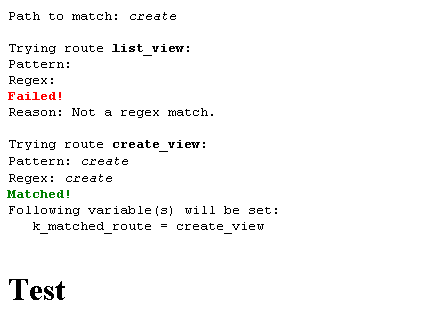
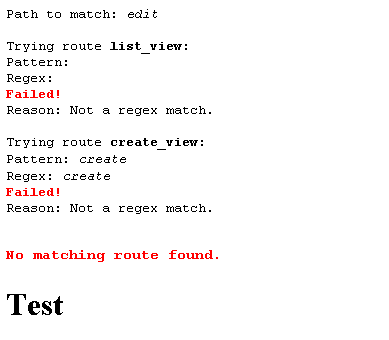
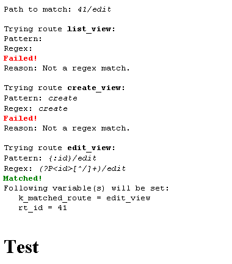
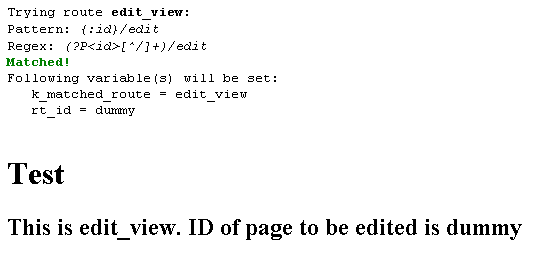
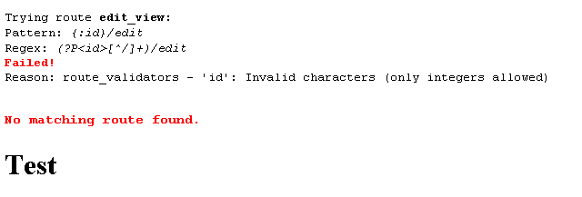
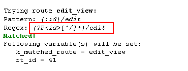
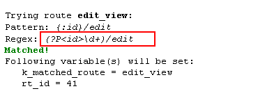
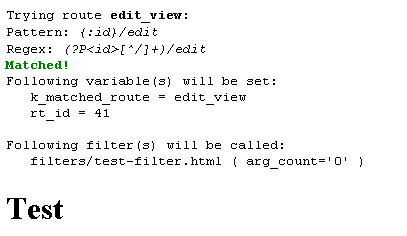
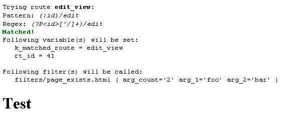

# Custom Routes

If you've worked for any amount time with Couch, you'd certainly be familiar with its various views - namely the 'page-view', 'list-view', 'home-view', 'folder-view' and 'archive-view'.

You'd also be aware that each of the aforementioned views is triggered by URLs with certain fixed patterns in them e.g. the following URLs will lead to a page-view

```
http://www.yoursite.com/blog.php?p=12
http://www.yoursite.com/blog/some_page_name.html (with prettyURLs activated)
```
In the URLs above, it is the '?p=x' or the '/x.html' that signals to Couch that this is a page-view.

Similarly, in the following URLs, it is the '?d=201501' or the '/2015/01/' that invokes the archive-view.

```
http://www.yoursite.com/blog.php?d=201501
http://www.yoursite.com/blog/2015/01/ (with prettyURLs activated)
```

Roughly speaking, when Couch matches a URL to the available views, it does the following -

a. Examines the URL used to access the page and matches it against some fixed patterns.

b. If a match is found, it carries out additional validations e.g. in page-view the 'p' should be a non-zero integer and a page with that id should also exist. Similarly in archive-view the values supplied for the year and month should be valid.

c. If validations succeed, it sets a variable indicating the name of the matched 'view'. It also makes available the arguments supplied in the URL (e.g. the value of 'p' etc.) as variables. The Couch tags placed in the template can now make use of these variables to alter the output of the page e.g.
```xml
<cms:if k_is_page>..</cms:if>
```

d. If the validations fail, it throws a distinct error. Similarly if the URL does not match any known pattern a 'Page not found' HTTP 404 is thrown.

For most brochure type sites, the default views (and hence the corresponding URLs) suffice. However, 'application' type sites (e.g. where registered users can create/edit/delete their own pages/data etc.), usually require passing more information through the URLs than what the default views do. For example, following could be a prettyURL that edits invoice no. 190 that resides in a folder of id 11 -

`http://www.yoursite.com/invoice/190/edit/11/folder/`


Clearly, the default views of Couch won't be of much help in this situation. To help handle such cases, Couch now ships with an addon named 'routes' that'll allow us to register our own patterns and thus define our custom views.

# The 'Routes' addon

As has been our practice, instead of rolling out dry specifications of this addon's tags and parameters, we'll take a hands-on approach and make use of custom routes in a template.

As the very first step we need to activate this addon.

To do so, add the following line to 'couch/addons/kfunctions.php' of your installation (you might have to rename `kfunctions.example.php` to `kfunctions.php` for newer installations)

```php
require_once( K_COUCH_DIR.'addons/routes/routes.php' );
```

With the addon activated, let us begin experimenting with it by creating a test template (say named 'test.php'). Place the following code in it and register it by visiting it as super-admin -

```php
<?php require_once( 'couch/cms.php' ); ?>
    <cms:template clonable='1' >

    </cms:template>

    <h1>Test</h1>

<?php COUCH::invoke(); ?>
```

The code above is the standard code we place in any template to make it a Couch managed one.
To make our template support custom routes, we need to make two little changes to this code -

```php
<?php require_once( 'couch/cms.php' ); ?>
    <cms:template clonable='1' routable='1' >

    </cms:template>

    <h1>Test</h1>

<?php COUCH::invoke( K_IGNORE_CONTEXT ); ?>
```

The first change (adding **routable='1'** to the cms:template tag) serves to attach the 'routes' addon to this template. We'll now be able to define our custom views for this template.

The second change (adding **K_IGNORE_CONTEXT** to COUCH::invoke()) serves to instruct Couch to no longer apply the default views to this template. This is an important point - by doing this we are turning off Couch's default behavior of examining the URL used to access this template and then attaching one of the well-known views to it

---

NOTE: strictly speaking, Couch still attaches one view to this template - the 'home-view'. So whatever the URL used to access the template, if we query Couch about the view it'll always report 'home-view'. Thing is, we'll now use the 'routes' module and no longer use Couch's interpretation of the current view so this is not a problem.

---

Now we are ready to define our own routes (and hence 'views') for this template.

## Simple Routes

Simple Routes:
Let us begin by defining two very simple ones -

```xml
<cms:template clonable='1' routable='1' >

   <!-- define routes -->
   <cms:route name='list_view' path='' />

   <cms:route name='create_view' path='create' />

</cms:template>


   <!-- find the matched route (view) -->
   <cms:match_route debug='1' />

<h1>Test</h1>
```

As you can see, we have used the **cms:route** tag inside the cms:template block to define the two routes.

Please also notice that we have used a **cms:match_route** tag right outside the cms:template block.

Using custom routes requires the use of both these tags in tandem - multiple instances of the cms:route tag define the various routes within the cms:template block while a single cms:match_route tag placed somewhere in the main body of the template (usually as the first statement after the cms:template block) does the actual match processing by comparing the incoming URL with the routes we defined above.

For now we have set the 'debug' parameter of cms:match_route tag to '1' as this causes the tag to spit out all the processing steps it takes during the matching process. This makes it easier for us to see if our defined routes are working the way we had expected. We'll set the 'debug' to '0' (or remove the parameter altogether) once the routes are finalized.

Let us look at the cms:route tag a little more closely.

The 'name' parameter, expectedly, uniquely identifies a route amongst others in the template. The 'path' parameter is the most important of all and defines the 'pattern' against which the incoming URL is tested in a bid to find the matching route.

To understand that, let us study the second route first.

```xml
<cms:route name='create_view' path='create' />
```

Since we are assuming that our template is named 'test.php', with prettyURLs on the following URL will match this route -

`http://www.yoursite.com/test/create`

What happens when we don't have prettyURLs activated? In that case, the matching following URL will look like this -

`http://www.yoursite.com/test.php?q=create`

I think you can see where the value specified in the 'path' parameter appears in the URLs.

OK, so now take a look at the first route we registered.

```xml
<cms:route name='list_view' path='' />
```

Notice how its 'path' parameter is set to blank. This would simply translate to the following URLs (i.e. where the template is invoked with no additional route info)

```
http://www.yoursite.com/test/
http://www.yoursite.com/test.php (without prettyURLs)
```

Time to test our routes out.
Access the template as super-admin, typing the following in your browser's address bar (of course putting your server's address in it), and see what the cms:match_route tag reports -

`http://www.yoursite.com/test.php?q=create`

---

At this point, I'd assume that you won't have prettyURLs activated so you'll have to use the non-pretty version of the URLs.

---

You should get something like this -



If instead you get 'No routes defined' message, just refresh the template as this could happen the very first time a template is accessed after defining routes

Now try accessing `http://www.yoursite.com/test.php` and you should see the 'list_view' getting selected.

As you can see, the cms:match_route takes the term 'create' (which is the 'q' querystring parameter in the URL) and then tries to match it sequentially with all the defined routes (we have only two for now). Once a match is found, it reports the name of the route and declares that a variable named 'k_matched_route' would be set using the route's name.

We can now use this variable in our template's code to make further decisions about implementing the selected view e.g.

```xml
<cms:template clonable='1' routable='1' >

   <!-- define routes -->
   <cms:route name='list_view' path='' />

   <cms:route name='create_view' path='create' />

</cms:template>


<!-- find the matched route (view) -->
<cms:match_route debug='1' />

<h1>Test</h1>

<!-- implement the selected view -->
<cms:if k_matched_route='list_view'>
   <h2>This is list_view</h2>
<cms:else_if k_matched_route='create_view' />
   <h2>This is create_view</h2>
</cms:if>
```

Ok, so what happens if none of the defined routes match? Let us try by accessing the following URL -

`http://www.yoursite.com/test.php?q=edit`

You should get -




Tag cms:match_route is dutifully reporting that 'No matching route found'.

How do we factor this in our code where we implement the selected view (considering that no defined view matches the visitor's requested URL)? That is completely our choice. If, as is the most common scenario, we wish to respond with HTTP 404 'Page not found' error, the easiest way would be to instruct the cms:match_route tag itself to do it for us by setting its 'is_404' parameter to '1' -

```xml
<!-- find the matched route (view). Respond with 404 if no route matches. -->
<cms:match_route debug='1' is_404='1' />
```

Please note that the cms:match_route tag will honor the 'is_404' setting only when 'debug' is not in effect. So, in the code above, set the 'debug' to '0' and then try visiting the non-existing route `http://www.yoursite.com/test.php?q=edit` again to see how it works.

If, however, instead of 404 we wish to take some other action in case of a non-match, we can modify our code like this -

```xml
<!-- find the matched route (view) -->
<cms:match_route debug='1' />

..

<!-- implement the selected view -->
<cms:if k_matched_route != '' >

   <cms:if k_matched_route='list_view'>
      <h2>This is list_view</h2>
   <cms:else_if k_matched_route='create_view' />
      <h2>This is create_view</h2>
   </cms:if>

<cms:else />
   .. No route matched. Take some action ..
</cms:if>
```

In the modified code above we make use of the fact that if no view gets selected the 'k_matched_route' variable would remain blank.

OK, so now, hopefully, we should have a fair idea about how custom routes work.
We can now move on to defining more complex routes and exploring the other features offered by cms:route tag.

## Complex Routes (with parameters)

Consider the following scenario - suppose we need to grant our registered users the ability to 'edit' their own pages (using DataBound Forms).

So assume that, in the 'list_view' we created above, we show a list of pages created by them. Alongside each page is an icon that opens up a page where we display a Databound Form already populated by the selected page's data and ready to be edited. Let us call this the 'edit_view'.

Clearly while invoking this 'edit_view', we'll have to pass it a unique identifier (e.g. name or ID) of the page it is supposed to edit. We can do this (as is the convention) by providing this value through the URL used to invoke the edit_view.

One reasonable format of the URL could be -


`http://www.yoursite.com/test/41/edit`

or

`http://www.yoursite.com/test.php?q=41/edit (without prettyURLs)`


In the URLs above the '41' would be the ID of the page to be edited. Now obviously, this value will vary with each page so we could have URLs like

```
http://www.yoursite.com/test/22/edit
http://www.yoursite.com/test/362/edit etc.
```

As can be seen, the 'edit' segment of the route remains the same for all URLs but the numeric segment preceding it varies.

Let us now define such a route where one or several segments of the URL are not known beforehand (i.e. will be variable). Add the new route to our existing two routes -

```xml
<cms:template clonable='1' routable='1' >

    <!-- define routes -->
    <cms:route name='list_view' path='' />

    <cms:route name='create_view' path='create' />

    <cms:route name='edit_view' path='{:id}/edit' />

</cms:template>
```

The enclosing '{:' and '}' is a signal to Couch that 'id' is a 'placeholder' (as opposed to the adjacent 'edit' which will always be a 'literal' value).

Access `http://www.yoursite.com/test.php?q=41/edit`. You should get -



Two things stand out in the data being reported -
1. Internally the 'regex' pattern being searched for is more complex that the simpler routes we had seen so far

```
Pattern: {:id}/edit
Regex: (?P<id>[^/]+)/edit
```

Since this something being handled internally, it is not of much concern to us for now. More important is the second point below.

2. Now two variables will be set by this route

```
Following variable(s) will be set:
k_matched_route = edit_view
rt_id = 41
```

The 'rt_id' variable is indicating the value used in the URL for the 'id' segment we specified in the route's path. As can easily be figured out, cms:match_route is simply adding a 'rt_' prefix to the name of the segment ('id' in this case).

The process remains the same even if there are multiple variable segments in the path e.g. for the following path the variables set by cms:match_route to show the values in the two placeholders would be 'rt_name' and 'rt_type' -

```
path='{:name}/edit/{:type}.html'
```

Continuing with the 'edit_view' route - we can now use the value provided by the URL as the page's 'id' as follows -

```xml
    ..
    ..
    <cms:else_if k_matched_route='edit_view' />
        <h2>This is edit_view. ID of page to be edited is <cms:show rt_id /></h2>
    </cms:if>
    ..
    ..
```

Of course, in a real-world scenario we'd be putting the 'id' to more serious use like using it with DataBound Form to edit the page.

OK, so now guess what happens when we access this view using the following URL -

Access `http://www.yoursite.com/test.php?q=dummy/edit` –



Uh oh! ID of page to be edited is *dummy*? Not good. ID of a page can only be an integer (a non-zero integer to be specific).

This example illustrates a vital point in creating any non-trivial application - you simply cannot trust any user-supplied value. Period.

> **Never, ever, use a user-supplied value without having first validated it.**

One way of doing this could be *after* a route has been selected e.g.

```xml
...
...
<cms:else_if k_matched_route='edit_view' />
    <cms:if "<cms:validate rt_id validator='non_zero_integer' />">
        <h2>This is edit_view. ID of page to be edited is <cms:show rt_id /></h2>
    <cms:else />
        Invalid value!
    </cms:if>
</cms:if>
...
```

A better option, however, is to do so *before* the route is flagged by cms:match_route has having matched. That is to say, make the validation a requirement for the match to happen. Let us see how.

## Validators

Following is the existing definition of our 'edit_view' route -

```xml
<cms:route name='edit_view' path='{:id}/edit' />
```

As can be seen, the cms:route tag is being used as a self-closing tag.
Modify it to make it a tag-pair version -

```xml
<cms:route name='edit_view' path='{:id}/edit' >

</cms:route>
```

and now place a cms:route_validators tag within it as its child -

```xml
<cms:route name='edit_view' path='{:id}/edit' >
    <cms:route_validators
        id='non_zero_integer'
    />
</cms:route>
```

Access again `http://www.yoursite.com/test.php?q=dummy/edit`. You should get -



As for which validators are available for use - we can use almost all those accepted by the cms:editable tag (as documented at http://www.couchcms.com/docs/tags-reference/editable/) namely -

```
min_len
max_len
exact_len
alpha
alpha_num
integer
non_negative_integer
non_zero_integer
decimal
non_negative_decimal
non_zero_decimal
email
title_ready
```

If the built-in validators do not suffice, we can even write our own custom validators (which are essentially nothing but simple PHP functions).

Multiple validators can be applied to the same route segment e.g. as shown in the following sample route

```xml
<cms:route name='sample_view' path='{:folder_name}/read/{:page_id}' >
    <cms:route_validators
        folder_name='title_ready | min_len=3 | max_len=32'
        page_id='non_zero_integer'
    />
</cms:route>
```

## Constraints

Very closely related to validators is another method that can be used to perform the same task of constraining the URL segments to defined formats. Recall that the 'path' we specify for a route is internally converted into a Regex which is then used to test the URL e.g. the 'path' of our 'edit_view' route -

```xml
<cms:route name='edit_view' path='{:id}/edit'>
    <cms:route_validators
        id='non_zero_integer'
    />
</cms:route>
```

&ndash; internally gets converted to the following regex (as reported by cms:match_route in debug mode) -



By using Route constraints we can modify the regex so that it becomes stricter and thus impose the desired constraints on the URL. We use the cms:route_constraints tag for specifying our own regex patterns. As an example, following is our 'edit_view' using cms:route_constraints instead of cms:route_validators -

```xml
<cms:route name='edit_view' path='{:id}/edit'>
    <cms:route_constraints
        id='(\d+)'
    />
</cms:route>
```

Compare the regex that cms:match_route reports now with the one shown earlier



At this point a logical question arises - if both cms:route_validators and cms:route_constraints do the same job, which of the two should we use?

Actually, you can even use them both together in the same route, if you so wish. For most cases, however, I'd say that you'll find cms:route_validators the easier of the two to use as it does not involve regular expressions. There are times, however, when specifying a regex pattern directly becomes necessary and then cms:route_constraints becomes the choice.

As an example of using both the methods together, let us define a final route for our template - the 'page_view'. In this view, we'll enforce that only URLs such as the following are used to access the view -

```
http://www.yoursite.com/test/some-page-name.html
http://www.yoursite.com/test.php?q=some-page-name.html (without prettyURLs)
```

Following is the route definition that'll do the job -

```xml
<cms:route name='page_view' path='{:page_name}{:format}'>
    <cms:route_constraints
        format='(\.html)'
    />
    <cms:route_validators
        page_name='title_ready'
    />
</cms:route>
```

We needed to use cms:route_constraints for this route because if we placed '.html' within the 'path' (i.e. path='{:page_name}.html'), the '.' within it is confused by the default generated regex to mean 'any single character' (you'll recognize this problem if you've worked with Regular Expressions).

OK, so as we have seen, with comparatively little effort, we can impose pretty water-tight restrictions on the URLs that can be used to access our template.

However, there are still certain conditions that cannot be enforced using validators/constraints alone. For example, in the 'sample_view' route we encountered before -

```xml
<cms:route name='sample_view' path='{:folder_name}/read/{:page_id}' >
    <cms:route_validators
        folder_name='title_ready | min_len=3 | max_len=32'
        page_id='non_zero_integer'
    />
</cms:route>
```

– we can ensure that a valid folder-name and a valid page-id are provided for the route to be considered a match. What we cannot do using validators (at least not with the built-in ones) and constraints is ensuring that –

a. A folder by the name provided exists

b. A page with the ID provided exists

c. The page really belongs to the folder

Obviously the aforementioned points cannot be ascertained without using some code. But don't worry - we can use our normal Couch tags to write that code. The cms:match_route tag allows us to use regular Couch 'snippets' to act as such 'filters'.

Let us see how.

## Filters

Filters, as mentioned, are regular Couch snippets (i.e. those that we invoke through cms:embed tag) with a few important differences. Let us see one in action and the differences will become apparent.

Snippets, as you know, are always placed within 'couch/snippets' folder (or any folder of your choice as specified in `couch/config.php` file).

Do the following -

1. Create a subfolder within the snippets folder mentioned above and name it 'filters' (this name is important). Assuming you have not changed the location of the snippets folder in config, you should now have a 'couch/snippets/filters' folder.
2. Create a file named 'page_exists.html' and place it in the folder we created above.
3. Our 'edit_view' route as it exist now is as follows -

```xml
<cms:route name='edit_view' path='{:id}/edit' >
    <cms:route_validators
        id='non_zero_integer'
    />
</cms:route>
```

Modify it to make it as follows

```xml
<cms:route name='edit_view' path='{:id}/edit' filters='page_exists'>
    <cms:route_validators
        id='non_zero_integer'
    />
</cms:route>
```

Note that we are *not* specifying the extension of our filter snippet.

Access the edit-view by using `http://www.yoursite.com/test.php?q=41/edit`

Assuming the cms:match_route tag has 'debug' set to '1', you should see -



Please notice that the cms:match_route tag has already declared the 'edit-view' as the matched route (which implies that all constraints specified in cms:route_validators tag have been met) and has set the required variables. It is only *after* a route is selected that the filters get called. Which means that if a called filter fails now, that would be the end of this page's processing. If there are any routes defined after this route, they won't be tested.

Compare it to the validators we used before where a failed validator caused the route not to match and the processing then moves on to test the routes that were defined after the failed route.

We can see that the cms:match_route is reporting that it will invoke the 'filters/page_exists.html'. Set its 'debug' parameter to '0' and access `http://www.yoursite.com/test.php?q=41/edit` again to see the invoked filter in action.

If the 'filters/page_exists.html' is empty (as it should be at this point), we'll see that the page gets processed normally.

Now do the following - add this line to 'filters/page_exists.html'

```html
<h2>Shoo off!</h2>
```

Access the 'edit-view' again and you should see the page rudely asking us to 'Shoo off!'.


Important point about filters here is that if a filter chooses to output *anything* (excluding whitespaces or newlines), cms:match_route tag will consider that as an error message returned by the filter and will summarily terminate the page showing instead only that output.

In other words, our filter should do all the constraints checking and validation it wants to and if everything is fine, it should remain silent ('No news is good news'). It should output the error messages only if the checks fail and these would then be displayed to the visitor with the script terminated without any further processing.

Let us modify our filter to make it actually check something. Place the following within it -

```xml
<cms:if "<cms:not "<cms:page_exists id=rt_id masterpage=k_template_name />" />" >
    <h2>Shoo off!</h2>
</cms:if>
```

The code above will output the remark only if a page with the ID specified in the URL (notice the 'rt_id' being used) does not exist as a cloned page of the current template.

---

NOTE: Since, in the case of the filter failing any check, the page being accessed will in any case be terminated, following are two variations that a filter snippet can use in lieu of specifying an error message that the calling cms:match_route tag displays while killing the page -

1. Abort the page by itself e.g.
   ```xml
   <cms:if "<cms:not "<cms:page_exists id=rt_id masterpage=k_template_name />" />" >
       <cms:abort is_404='1' />
   </cms:if>
   ```
2. Redirect to different page. This can be very useful for filters that enforce 'access control' e.g. ensuring that only a logged-in user can access the page e.g. place the following in a snippet named 'authenticated.html' and we have a filter that will allow only logged-in users to access the route -
   ```xml
   <cms:if k_logged_out >
       <cms:redirect k_login_link />
   </cms:if>
   ```


###   Chaining filters

Multiple filters can be applied to a route e.g. in the code below, the 'test_view' route has three filters attached to it

```xml
<cms:route name='test_view' path='{:id}/edit' filters='authenticated | page_exists | is_owner' />
```

As can be seen, we use the pipe (|) character to separate the filters.

Filters are applied in the sequence they are specified e.g. in the example above the 'authenticated' filter will be invoked first. In case this filter fails, the page is terminated and the remaining filters do not get called. If, however, it succeeds, the next filter (i.e. 'page_exists') gets called and the process is repeated.

The way filters get called make them act as if they were chained together - that is to say, the code found in 'page_exists' filter can positively assume that the visitor accessing the page is an authenticated user because the 'authenticated' filter would have already run before it. Similarly, in the 'is_owner' filter (where, supposedly, we'll try to ascertain that the logged-in user is also the owner of the page being edited), our code can positively assume that a logged-in user is present and that the specified page also exists.

###   Passing arguments to filters

Filters are slightly different than ordinary snippets in that we can pass parameters to them. Let us see how. Modify the definition of our 'edit_view' route from this -

```xml
<cms:route name='edit_view' path='{:id}/edit' filters='page_exists'>
```

to this -

```xml
<cms:route name='edit_view' path='{:id}/edit' filters='page_exists=foo, bar'>
```

Set the 'debug' parameter of the cms:match_route tag back to '1' and access the edit_view (`http://www.yoursite.com/test.php?q=41/edit`).



Notice the additional info being reported for the filter to be called

```
Following filter(s) will be called:
filters/page_exists.html ( arg_count='2' arg_1='foo' arg_2='bar' )
```

Notice how the 'arg_1' and 'arg_2' variables hold the values of the two parameters ('foo' and 'bar') we passed to the filter. Had there been a third argument, it'd be made available as 'arg_3'. The 'arg_count' variable always reports the number of arguments passed to the filter.

We can now make use of these variables in our code within the filter e.g. `<cms:show arg_2 />`.

How is this feature of passing arguments to filter useful?

Arguments can make it possible to reuse a filter across different situations. For example, we can pass the name of 'masterpage' as argument and so use the same filter with different templates.

Let us use a filter argument to reuse the 'page_exists' filter, used with 'edit_view' before, now with the 'page_view' route. Modify the existing 'page_view' route to add the filters as follows -

```xml
<cms:route name='page_view' path='{:page_name}{:format}' filters='page_exists=name'>
    <cms:route_constraints
        format='(\.html)'
    />
    <cms:route_validators
        page_name='title_ready'
    />
</cms:route>
```

As we have seen, this route enforces that only URLs such as the following will be allowed -

```
http://www.yoursite.com/test/some-page-name.html
http://www.yoursite.com/test.php?q=some-page-name.html (without prettyURLs)
```

The 'title_ready' validator will ensure that only a valid page_name is supplied. The 'page_exists' filter will ensure that a page with that name actually exists.

Problem is that the existing code within 'page_exists' filter (i.e. within 'snippets/filters/page_exists.html'), currently uses 'ID' to check for the existence of a page while we want to check for page_name.

One option is to create a separate filter (say named 'page_exists_name') that uses page_name to verify a page's existence.

We'll, instead, modify the existing 'page_exists' filter and make it use both ID as well as page_name to do the check. To make it use name. we'll simply pass it 'name' as its first parameter (note how our route is doing this by setting: filters='page_exists=name').

The code in 'page_exists' can now be modified to check if 'name' is the first parameter. If it is, the page_name is checked else the ID is used.
The modified code now becomes -

```xml
<cms:if arg_1='name'>
    <cms:if "<cms:not "<cms:page_exists name=rt_page_name masterpage=k_template_name />" />" >
        <cms:abort is_404='1' />
    </cms:if>
<cms:else />
    <cms:if "<cms:not "<cms:page_exists id=rt_id masterpage=k_template_name />" />" >
        <cms:abort is_404='1' />
    </cms:if>
</cms:if>
```

Ok, so we have now covered most of the concepts involving creating and using custom routes.
One final piece remains that will complete the discussion.

## Generating custom URLs

Throughout this tutorial we have been 'hand-crafting' the URLs leading to the various views we have defined (and feeding them in the browser's address-bar).

Let us now see how to generate those URLs programmatically.

As you'd remember, in normal Couch templates (i.e. those that do not use the custom routes), the system provides us with the variable named k_page_link that contains the URL of the cloned-pages. Additionally we use the cms:link tag to generate URLs of all the canonical views.

With custom routes added to a template, both these methods will cease to work.

Instead, we now use the cms:route_link tag to generate URLs for the custom routes we have defined.

As an example, if we place the following code in our test template, it'll generate the 'edit_view' URL.

```xml
<cms:route_link 'edit_view' rt_id='41' />
```

If the code is placed in some other template, we'll have to specify the template containing the route's definition using the 'masterpage' parameter

```xml
<cms:route_link 'edit_view' masterpage='test.php' rt_id='41' />
```

The cms:route_link tag expects the 'name' of the route as its first parameter. We'll also have to provide it with values for all the parameters in the route's 'path'. The 'edit_view' had the following as its path where 'id' was the only parameter -

```
path='{:id}/edit'
```

and so we provided the value for 'id' to cms:route_link as a parameter named 'rt_id' (i.e. by prefixing 'rt_' to the route's parameter).

Let us output a list of all cloned pages of our test template in its 'list_view' and provide each page with its 'page_view' and 'edit_view' link.

Amend the code in the list_view handler to add the cms:pages listing as shown below.

```xml
<!-- implement the selected view -->
<cms:if k_matched_route='list_view'>
    <h2>This is list_view</h2>

    <cms:pages>
        <a href="#">
            <cms:show k_page_title />
        </a>

        <a href="#">
            [EDIT]
        </a>
        <br/>
    </cms:pages>

<cms:else_if k_matched_route='create_view' />
    ...
    ...
```

Create a few cloned pages out of our test template and then access the list_view (i.e. `http://http://www.yoursite.com/test.php`). You should see all the pages getting listed. The link, for now, contain only a placeholder '#'. Amend the code to use the cms:route_link to output the two kinds of URLs as follows -

```xml
<!-- implement the selected view -->
<cms:if k_matched_route='list_view'>
    <h2>This is list_view</h2>

    <cms:pages>
        <a href="<cms:route_link 'page_view' rt_page_name=k_page_name rt_format='.html' />">
            <cms:show k_page_title />
        </a>

        <a href="<cms:route_link 'edit_view' rt_id=k_page_id />">
            [EDIT]
        </a>
        <br/>
    </cms:pages>

<cms:else_if k_matched_route='create_view' />
    ...
    ...
```

Notice how we are providing the right parameters for each view to the cms:route_link tag.
Test out to see how the links invoke the right views.

## Afterword

The end, finally.

With this we have now completed our (rather long) journey through custom routes.

Following is how our test.php template finally looks like -

```xml
<?php require_once( 'couch/cms.php' ); ?>
    <cms:template clonable='1' routable='1' >

        <!-- define routes -->
        <cms:route name='list_view' path='' />

        <cms:route name='create_view' path='create' />

        <cms:route name='edit_view' path='{:id}/edit' filters='page_exists'>
            <cms:route_validators
                id='non_zero_integer'
            />
        </cms:route>

        <cms:route name='page_view' path='{:page_name}{:format}' filters='page_exists=name'>
            <cms:route_constraints
                format='(\.html)'
            />
            <cms:route_validators
                page_name='title_ready'
            />
        </cms:route>

    </cms:template>


    <!-- find the matched route (view). Respond with 404 if no route matches. -->
    <cms:match_route debug='1' is_404='1' />

    <h1>Test</h1>

    <!-- implement the selected view -->
    <cms:if k_matched_route='list_view'>
        <h2>This is list_view</h2>

        <cms:pages>
            <a href="<cms:route_link 'page_view' rt_page_name=k_page_name rt_format='.html' />">
                <cms:show k_page_title />
            </a>

            <a href="<cms:route_link 'edit_view' masterpage=k_template_name rt_id=k_page_id />">
                [EDIT]
            </a>
            <br/>
        </cms:pages>

    <cms:else_if k_matched_route='create_view' />
        <h2>This is create_view</h2>
    <cms:else_if k_matched_route='edit_view' />
        <h2>This is edit_view. ID of page to be edited is <cms:show rt_id /></h2>
    <cms:else_if k_matched_route='page_view' />
        <h2>This is page_view. Name of page to be edited is <cms:show rt_page_name /></h2>
    </cms:if>


<?php COUCH::invoke( K_IGNORE_CONTEXT ); ?>
```

In closing, I'll quote a paragraph I used at the beginning of this thread where I described the actions taken by Couch while routing the default views&nbsp;–

---

Roughly speaking, when Couch matches a URL to the available views, it does the following -

a. Examines the URL used to access the page and matches it against some fixed patterns.

b. If a match is found, it carries out additional validations e.g. in page-view the 'p' should be a non-zero integer and a page with that id should also exist. Similarly in archive-view the values supplied for the year and month should be valid.

c. If validations succeed, it sets a variable indicating the name of the matched 'view'. It also makes available the arguments supplied in the URL (e.g. the value of 'p' etc.) as variables. The Couch tags placed in the template can now make use of these variables to alter the output of the page e.g. `<cms:if k_is_page>..</cms:if>`

d. If the validations fail, it throws a distinct error. Similarly if the URL does not match any known pattern a 'Page not found' HTTP 404 is thrown.

---

Please compare the points above with what custom routes do and you'll see that now we can mimic the default logic of Couch with almost any kind of custom URL structure.
