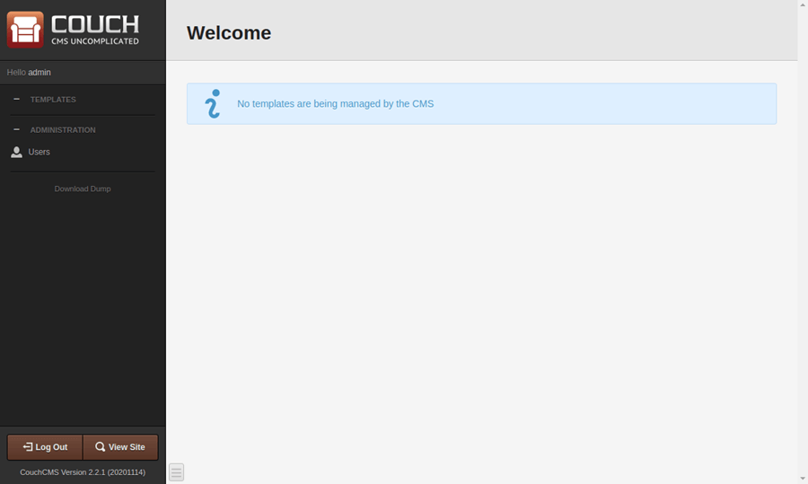
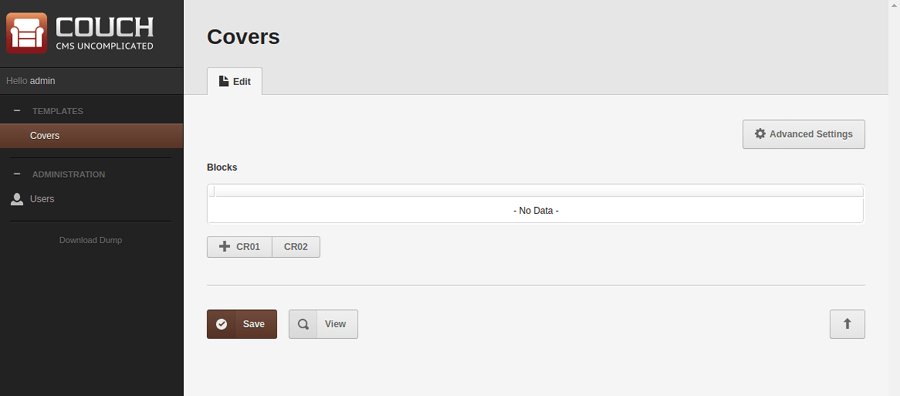
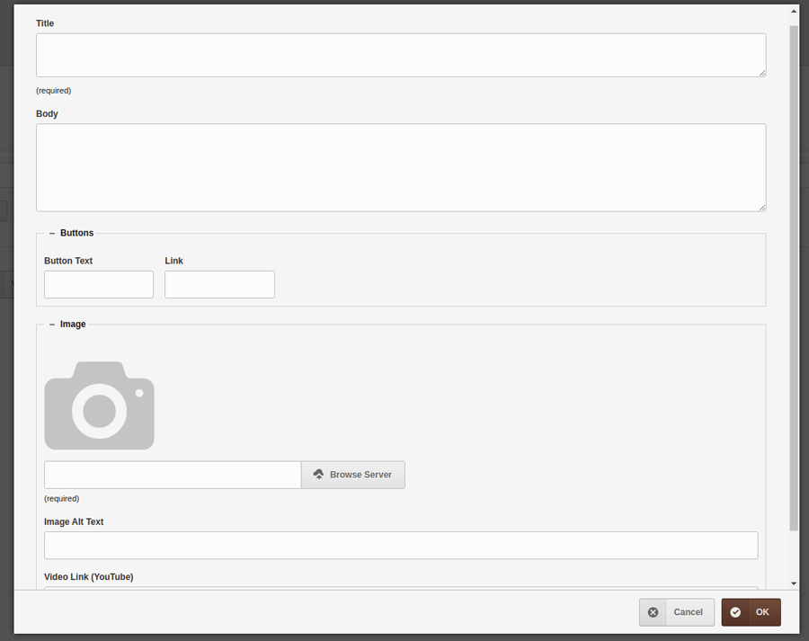
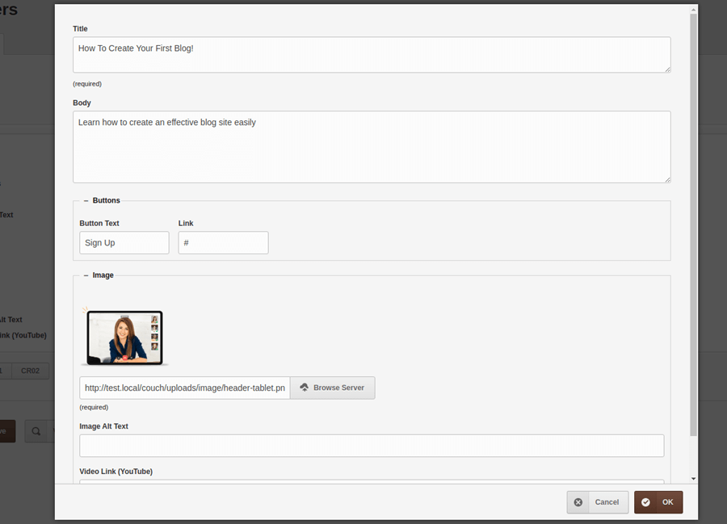
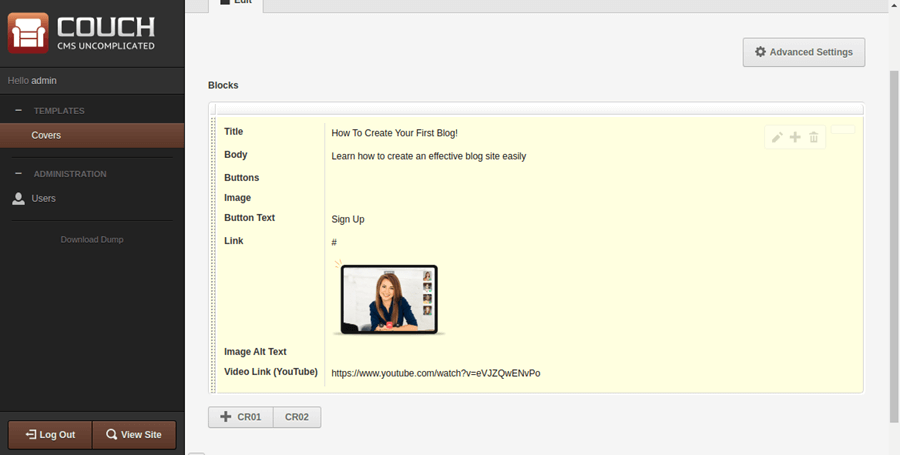
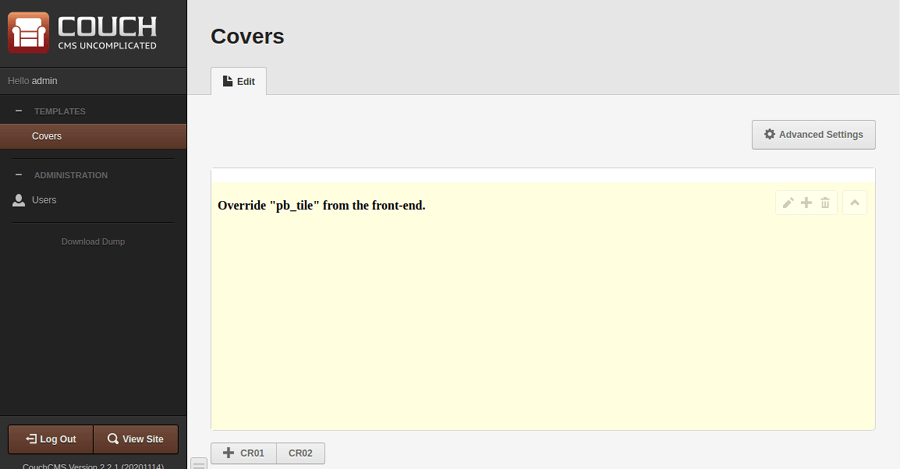
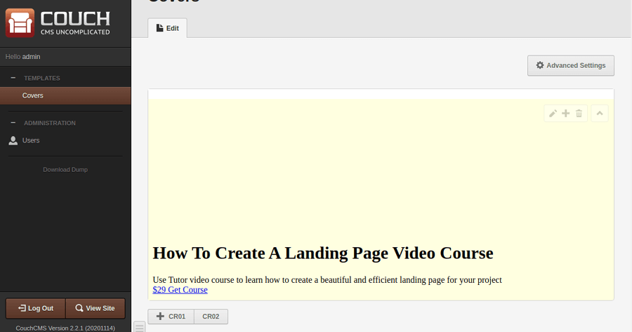
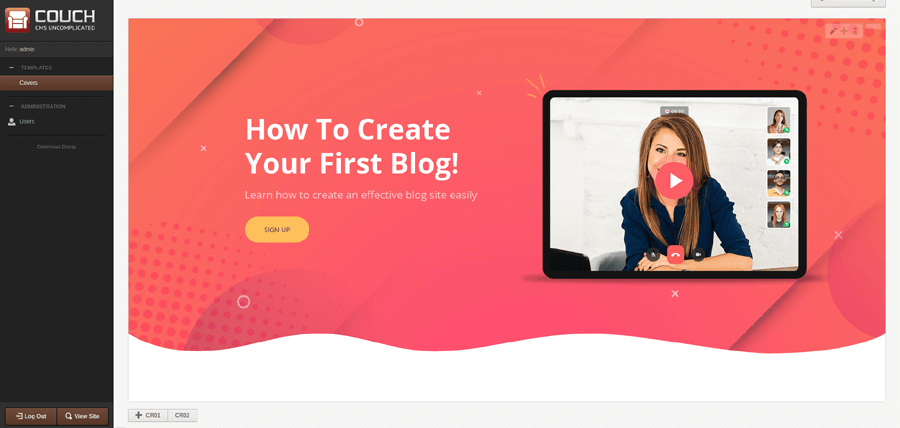
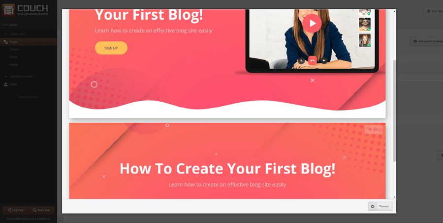
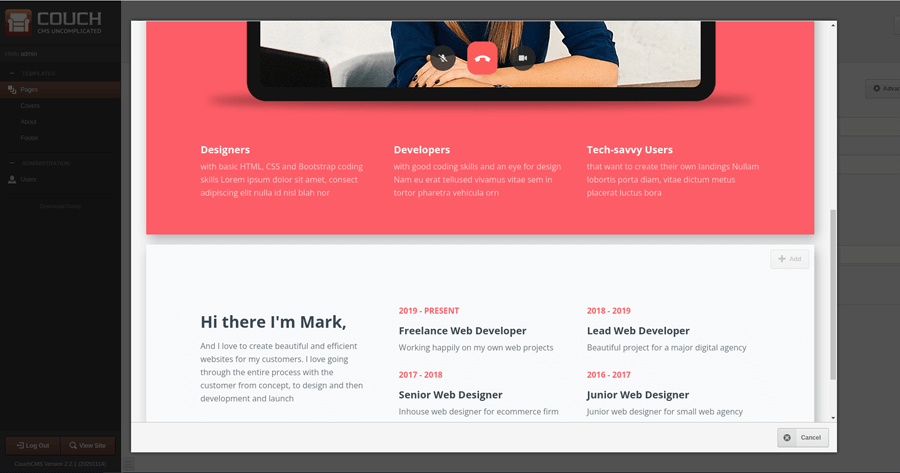

# [Pagebuilder](https://github.com/trendoman/Midware/tree/main/concepts/Pagebuilder)

PageBuilder offers a new way of building sites for your clients.

## Demo

See it in action here in a short 90 seconds youtube[^1] video —

https://user-images.githubusercontent.com/6024107/208204860-2460d09f-f772-49f9-a12f-ff2f1b53e522.mp4

[^1]: [https://www.youtube.com/watch?v=swR52Winn-E](https://www.youtube.com/watch?v=swR52Winn-E) — source

## About

OK, as I am sure you would have figured out from the video, the idea here is to divide up a site into sets of visual blocks (e.g. covers, contacts, teams, pricing etc.) and then use the pagebuilder to offer them to the end-users for crafting pages on their own.

---

If you are familiar with Couch, you are likely to notice that the existing 'Mosaic' feature ([viewtopic.php?f=5&t=11105](https://www.couchcms.com/forum/viewtopic.php?f=5&t=11105)) holds out a similar premise. And you would be right! - the pagebuilder, in fact, is a super-set of the mosaic and uses it extensively (as you'll shortly see in the tutorial that follows).

The most prominent difference is that the pagebuilder, unlike the mosaic, displays blocks in a **WYSIWYG** (what you see is what you get) manner so you can
offer the end-user an entirely different experience where she can visually pick-n-choose blocks to build her pages.

---

Depending upon the use-case, you may use this feature for creating entire sites or you could use this only for certain sections of a site.

The video you saw above is a site that takes the first tack - it is a full-fledged site divided into **100+** blocks (grouped in 17 sections).

It is available under regular Couch license so you may freely download it to either use it or study it for creating similar sites of your own.

https://themes.couchcms.com/tutor/ \
https://github.com/CouchCMS/Tutor

If that 'creating similar sites of your own' part interests you, following is a detailed tutorial where I create a simplified version of the site mentioned above
(using only 4 blocks in 2 sections).

# Tutorial

Download and unzip the following file.

[www.zip](assets/www.zip) (337.94 KiB)

Place contents of the extracted 'www' folder within your site root (for this tutorial, I'll assume the site is http://test.local/).

Try accessing http://test.local/covers.html


http://test.local/about.html


These are the 2 sections and the 4 blocks I mentioned which we'll now convert into reusable blocks.

---

**Caveat Emptor!**

While converting the first section, I'll spell out all gory details of the process.
You are more than likely to find the process convoluted and long-drawn.

Please bear with it. While converting the second section, I'll mention only the salient points and then you'll
certainly realize that the process is actually much simpler and straightforward than what it initially appears.

---

Forewarned now, let us proceed :)

## Install Couch

Nothing new here - am repeating the steps just for the sake of completeness.

Download the latest version of Couch ([master.zip](https://github.com/CouchCMS/CouchCMS/archive/refs/heads/master.zip)) and place the 'couch' folder into the site root.

Rename `couch/config.example.php` to `config.php` and edit it to enter your database's info.

Access http://test.local/couch/ to complete the installation.



## Enable PageBuilder

Rename `couch/addons/kfunctions.example.php` to `kfunctions.php`. Edit it to uncomment the following line —

```php
require_once( K_COUCH_DIR.'addons/page-builder/page-builder.php' );
```

## Create blocks

As mentioned, we have two sections (groups) of blocks - 'covers' and 'about'.

For each section we'll create a non-clonable template (I'll refer to them as the 'block templates').

To keep the site root uncluttered, we'll keep these templates in a folder named 'blocks' within our site root. Here is the site structure we'll end up with -

```txt
www
    |_blocks
        |_about.php
        |_covers.php
    |_couch
```

---

Please note that now because the templates are situated within a folder, their names as used for the 'masterpage' param will become 'blocks/covers.php' and 'blocks/about.php'

---

Let us begin with 'covers'.

Create 'blocks/covers.php' and edit it to place the following within -

```xml
<?php require_once( '../couch/cms.php' ); ?>
<cms:template title='Covers' order='1' clonable='0'>

    <cms:mosaic name='blocks' label='Blocks'>
        <cms:tile name='cr01' label='CR01'>

        </cms:tile>

        <cms:tile name='cr02' label='CR02'>

        </cms:tile>
    </cms:mosaic>

</cms:template>
<?php COUCH::invoke(); ?>
```

As you can see, the code above makes 'blocks/covers.php' a non-clonable template and also defines within it a 'mosaic' region.

The two (still empty) tiles that are defined within the mosaic are the two cover blocks that we have set out to build.

Names of the tiles above are arbitrary and you may choose your own - I am using here the ones I chose for the site we are replicating. Complete the mandatory 'visit the modified template as super-admin' step to persist the changes. Coming back to the admin-panel, you should find the covers template displaying a mosaic field with buttons for adding the two tiles



Of course, at this point if you try adding any of the tiles, you'll see a (self-explanatory) "No Editable Regions defined" message. Let us change that by defining the editable regions required by each tile.

A quick look at the first cover block will tell us that we'll need, at least, regions for the title, body, button and the image (with link for the popup video).

Following is how I defined those regions -

```xml
<cms:mosaic name='blocks' label='Blocks'>
    <cms:tile name='cr01' label='CR01'>
        <cms:editable name='title' label='Title' type='textarea' height='60' order='1' required='1' />
        <cms:editable name='body' label='Body' type='textarea' height='120' order='2'  />

        <cms:editable name='row_buttons' type='row' label='Buttons' order='3' collapsed='0'>
            <cms:editable name='button_text' type='text' label='Button Text' class='col-xs-4 col-md-2' />
            <cms:editable name='button_link' type='text' label='Link' class='col-xs-4 col-md-2' />
        </cms:editable>

        <cms:editable name='row_image' type='row' label='Image' order='4' collapsed='0'>
            <cms:editable name='image' type='image' label='&nbsp;' show_preview='1' preview_width='150' required='1' />
            <cms:editable name='image_alt' label='Image Alt Text' type='text' />
            <cms:editable name='image_link' label='Video Link (YouTube)' type='text' />
        </cms:editable>
    </cms:tile>

    <cms:tile name='cr02' label='CR02'>

    </cms:tile>
</cms:mosaic>
```

The result -



You'll recognize that I have used the 'Bootstrap grid' ([viewtopic.php?f=8&t=11023](https://www.couchcms.com/forum/viewtopic.php?f=8&t=11023)) to arrange the regions in a more manageable way.

Moving on to the second cover block, we define its regions as follows -

```xml
<cms:mosaic name='blocks' label='Blocks'>
    <cms:tile name='cr01' label='CR01'>
        <cms:editable name='title' label='Title' type='textarea' height='60' order='1' required='1' />
        <cms:editable name='body' label='Body' type='textarea' height='120' order='2'  />

        <cms:editable name='row_buttons' type='row' label='Buttons' order='3' collapsed='0'>
            <cms:editable name='button_text' type='text' label='Button Text' class='col-xs-4 col-md-2' />
            <cms:editable name='button_link' type='text' label='Link' class='col-xs-4 col-md-2' />
        </cms:editable>

        <cms:editable name='row_image' type='row' label='Image' order='4' collapsed='0'>
            <cms:editable name='image' type='image' label='&nbsp;' show_preview='1' preview_width='150' required='1' />
            <cms:editable name='image_alt' label='Image Alt Text' type='text' />
            <cms:editable name='image_link' label='Video Link (YouTube)' type='text' />
        </cms:editable>
    </cms:tile>

    <cms:tile name='cr02' label='CR02'>
        <cms:editable name='title' label='Title' type='textarea' height='60' order='1' required='1' />
        <cms:editable name='body' label='Body' type='textarea' height='120' order='2'  />

        <cms:editable name='row_buttons' type='row' label='Buttons' order='3' collapsed='0'>
            <cms:editable name='button_text' type='text' label='Button Text' class='col-xs-4 col-md-2' />
            <cms:editable name='button_link' type='text' label='Link' class='col-xs-4 col-md-2' />
        </cms:editable>
    </cms:tile>
</cms:mosaic>
```

As you can see in the code above, if there had been a greater number of blocks (i.e. tiles) or if the tiles had many more editable regions, our template above would quickly become very cluttered.

To prevent that (and for other manageability concerns that we'll find ahead), let us move the code defining the editable regions above into separate 'snippets'.

By default Couch expects all snippets to be within 'couch/snippets' folder (this location can be changed from `couch/config.php` but I am assuming we are using the default) so I created a folder named 'pb' within it (again, an arbitrary name - pagebuilder shortened to pb) and then created separate folders for each block types.

```txt
snippets
    |_pb
        |_about
            |_embed
            |_theme
        |_covers
            |_embed
            |_theme
        |_misc
            |_embed
            |_theme
```

You'll notice that I have further sub-divided each block folder into 'embed' and 'theme' - we'll use that 'theme' folder a little later in this tutorial (same goes for the additional 'misc' folder). For now we'll concern ourselves with just the 'embed' folder within each block type to keep their snippets in.

OK, next we'll create empty snippets within each block type (names are arbitrary - I find it easier to use the ones I used for the 'tiles' definition).

```txt
snippets
    |_pb
        |_about
            |_embed
                |_AB01.html
                |_AB02.html
            |_theme
        |_covers
            |_embed
                |_CR01.html
                |_CR02.html
            |_theme
        |_misc
            |_embed
            |_theme
```

Now we can cut and paste the code for editable regions from our original code above into the 'CR01.html' and 'CR02.html' making them as follows -

*CR01.html*

```xml
<cms:editable name='title' label='Title' type='textarea' height='60' order='1' required='1' />
<cms:editable name='body' label='Body' type='textarea' height='120' order='2'  />

<cms:editable name='row_buttons' type='row' label='Buttons' order='3' collapsed='0'>
    <cms:editable name='button_text' type='text' label='Button Text' class='col-xs-4 col-md-2' />
    <cms:editable name='button_link' type='text' label='Link' class='col-xs-4 col-md-2' />
</cms:editable>

<cms:editable name='row_image' type='row' label='Image' order='4' collapsed='0'>
    <cms:editable name='image' type='image' label='&nbsp;' show_preview='1' preview_width='150' required='1' />
    <cms:editable name='image_alt' label='Image Alt Text' type='text' />
    <cms:editable name='image_link' label='Video Link (YouTube)' type='text' />
</cms:editable>
```

*CR02.html*

```xml
<cms:editable name='title' label='Title' type='textarea' height='60' order='1' required='1' />
<cms:editable name='body' label='Body' type='textarea' height='120' order='2'  />

<cms:editable name='row_buttons' type='row' label='Buttons' order='3' collapsed='0'>
    <cms:editable name='button_text' type='text' label='Button Text' class='col-xs-4 col-md-2' />
    <cms:editable name='button_link' type='text' label='Link' class='col-xs-4 col-md-2' />
</cms:editable>
```

Our original code defining the mosaic can now link to the snippets above to become as follows -

```xml
<cms:mosaic name='blocks' label='Blocks'>
    <cms:tile name='cr01' label='CR01'>
        <cms:embed 'pb/covers/embed/CR01.html' />
    </cms:tile>

    <cms:tile name='cr02' label='CR02'>
        <cms:embed 'pb/covers/embed/CR02.html' />
    </cms:tile>
</cms:mosaic>
```

This is definitely much cleaner that the original version.

Visit the blocks/covers.php template as super-admin for the changes to persist and, coming back to the admin panel, you'll find that tiles show their regions in exactly the same manner as they did before their code was moved into snippets.

Alright, let us try and create some tiles now.

Click 'CR01' button, input some data and save.



You should get something like this -



The output above is the classic output one would expect from 'mosaic'; which shouldn't be surprising as we have been working with a regular mosaic upto this point.
It is time now to move from 'mosaic' to 'pagebuilder' and get instead the actual block rendered in its full glory.

To do that, begin by changing the mosaic's definition to make it as follows -

```xml
<cms:mosaic name='blocks' label='Blocks' body_class='_pb'>
    <cms:tile name='cr01' label='CR01' _pb_template='' _pb_height='350'>
        <cms:embed 'pb/covers/embed/CR01.html' />
    </cms:tile>

    <cms:tile name='cr02' label='CR02' _pb_template='' _pb_height='350'>
        <cms:embed 'pb/covers/embed/CR02.html' />
    </cms:tile>
</cms:mosaic>
```

You'll notice that we have made only two changes -
* a. Added ***body_class='_pb'*** to &lt;cms:mosaic>
* b. Added ***_pb_template='' _pb_height='350'*** to each &lt;cms:tile>

I'll get to what those '_pb_template' and '_pb_height' params do in just a bit. For now, visit the modified blocks/covers.php template as super-admin and then in the admin-panel re-edit the tile you saved in the last step.

Now when you save it, you should get.. this



> "Override "pb_tile" from the front-end."

Wow! Isn't that a wonderfully helpful message? Anyway, we are actually very close to what we set out to do. The changes we made before have certainly made the 'pagebuilder' addon step in and take over from 'mosaic'. As to what then it is complaining about, to understand that let us spare a few moments to see how the pagebuilder displays a block.

When a tile (block) is saved, pagebuilder combines the posted data with some HTML markup and then outputs the result in an &lt;IFRAME> (that IFRAME part is important as we'll see shortly below). Obviously, it needs to be told what HTML markup it is supposed to show for the block being displayed (as each block will have its own specific markup).
The message we saw above simply tells us that pagebuilder couldn't find any HTML markup associated with the block being saved that it could display.

Let us address this and specify the HTML markup associated with each of the two blocks we have implemented so far.

We know that the static HTML files (covers.html and about.html) we have in the site root contain the markup of our blocks. If you care to open up one of them, say covers.html, in your text editor, you'll see something like this (redacted version below) -

```html
<!DOCTYPE html>
<html>
    <head>
        <title>Covers</title>
        <link rel="stylesheet" href="assets/css/style.css" />
        <script src="assets/js/script.js"></script>
        ...
    </head>
    <body>
        <div id="el-page-container">
            <div id="el-page">

                <!-- cover block 1 -->
                <div id="section-2253" class="el-section tutor uk-position-relative uk-light">
                    <div class="el-container uk-container uk-position-relative">
                        ...
                    </div>
                </div>

                <!-- cover block 2 -->
                <div id="section-2254" class="el-section tutor uk-position-relative uk-light">
                    <div class="el-container uk-container uk-position-relative">
                        ...
                    </div>
                </div>

                <script>...</script>
            </div>
        </div>
    </body>
</html>
```

Up there we can spot the two cover blocks we are interested in.

This is the first one -

```html
<!-- cover block 1 -->
<div id="section-2253" class="el-section tutor uk-position-relative uk-light">
    <div class="el-container uk-container uk-position-relative">
        ...
    </div>
</div>
```

and this is the second -

```html
<!-- cover block 2 -->
<div id="section-2254" class="el-section tutor uk-position-relative uk-light">
    <div class="el-container uk-container uk-position-relative">
        ...
    </div>
</div>
```

We would like pagebuilder to show the first HTML markup above when it displays a CR01 block and the second one when it displays the CR02 block.

However, please recall that pagebuilder will use an IFRAME for display - the content of an IFRAME needs to be a complete HTML document and not just a fragment of it. So we'll have to actually specify *two* separate pieces of markup for rendering each block -

1. The markup for the block itself, as shown above for two blocks.
2. The markup for a *wrapper* around that block which will convert it into a valid HTML document.

That "wrapper" can be easily be extracted from the original markup itself. For example, following is what is left of the redacted HTML from covers.html above after we cut out all blocks from it -

**IMP:** Please note that we have added a &lt;cms:show pb_tile_content /> tag at the place where originally the blocks were; this tag would be dynamically replaced by pagebuilder with the contents of whichever block is currently being displayed.

```html
<!DOCTYPE html>
<html>
    <head>
        <title>Covers</title>
        <link rel="stylesheet" href="assets/css/style.css" />
        <script src="assets/js/script.js"></script>
        ...
    </head>
    <body>
        <div id="el-page-container">
            <div id="el-page">

                <cms:show pb_tile_content />

                <script>...</script>
            </div>
        </div>
    </body>
</html>
```

If needed, you may specify a simpler markup for the wrapper than what the frontend markup contains; usually it is only the CSS and JS components that are needed. Also, once you have the wrapper markup it can be usually be reused with *all* the blocks so it is a one-time affair.

So, we have the markup for the wrapper and the markups for the two cover blocks above.

We haven't yet told pagebuilder anything about how to find them (that is coming up next) but supposing we already did that, following is how pagebuilder will render the two blocks -

*CR01*

```html
<!DOCTYPE html>
<html>
    <head>
        <title>Covers</title>
        <link rel="stylesheet" href="assets/css/style.css" />
        <script src="assets/js/script.js"></script>
        ...
    </head>
    <body>
        <div id="el-page-container">
            <div id="el-page">

                <!-- cover block 1 -->
                <div id="section-2253" class="el-section tutor uk-position-relative uk-light">
                    <div class="el-container uk-container uk-position-relative">
                        ...
                    </div>
                </div>

                <script>...</script>
            </div>
        </div>
    </body>
</html>
```

*CR02*

```html
<!DOCTYPE html>
<html>
    <head>
        <title>Covers</title>
        <link rel="stylesheet" href="assets/css/style.css" />
        <script src="assets/js/script.js"></script>
        ...
    </head>
    <body>
        <div id="el-page-container">
            <div id="el-page">

                <!-- cover block 2 -->
                <div id="section-2254" class="el-section tutor uk-position-relative uk-light">
                    <div class="el-container uk-container uk-position-relative">
                        ...
                    </div>
                </div>

                <script>...</script>
            </div>
        </div>
    </body>
</html>
```

As can be seen, it is just a case of merging each block markup with the same wrapper code (notice how the &lt;cms:show pb_tile_content /> we placed within the wrapper gets substituted by each block's content).

Rendered within an IFRAME, each should render the block with perfect fidelity.

OK, with that understood, let us finally associate the markups with the blocks.

This step involves just a wee bit of PHP but let that not disconcert you if you are not comfortable with the language. It is boiler-plate code that you can just copy and paste into the indicated file.

Please open `couch/addons/kfunctions.php` in your text editor and paste the following code within it -

```php
$FUNCS->add_event_listener( 'override_renderables', function(){
    global $FUNCS;

    $FUNCS->override_render( 'pb_wrapper', array('template_path'=>K_COUCH_DIR.'snippets/pb/misc/theme/') );
    $FUNCS->override_render( 'pb_tile', array('template_path'=>K_COUCH_DIR.'snippets/pb/', 'template_ctx_setter'=>array('MyPB', '_render_pb_tile')) );
});

class MyPB{
    static function _render_pb_tile(){
        global $FUNCS, $CTX;

        $tpl_type = $CTX->get( 'k_template_type' );
        if( $tpl_type == 'tile' ){

            $tpl = $CTX->get( 'k_template__pb_template' ); // the template to render

            $tpl = trim( $tpl );
            if( $tpl!='' ){
                return array( $tpl );
            }
        }
    }
} // end class MyPB
```

You can absolutely move ahead without knowing a thing about what the code above does but I think it wouldn't be a bad idea to have at least a passing understanding of what is happening above.

You see, when pagebuilder tries to render a block it broadcasts a message (an 'event' actually) asking other modules to let it know two things -

1. The name of the file containing the markup it is supposed to display and
2. The location where it can find that file.

Also, if you recall the discussion about IFRAME we had above, it does this twice - once for the wrapper and then for the block itself.

The code we used above answers its queries for both the items using the *$FUNCS->override_render( 'pb_wrapper'* and *$FUNCS->override_render( 'pb_tile'* statements.

Notice specifically the value for the 'template_path' we are providing in both the statements -

For 'pb_tile' it is 'snippets/pb/' within the couch folder while for 'pb_wrapper' it is more specifically 'snippets/pb/misc/theme/' folder in the same location.
If you recall the folder structure we created in the beginning for placing snippets, the two paths above point to locations within the same tree -

```txt
snippets
    |_pb
        |_about
            |_embed
            |_theme
        |_covers
            |_embed
            |_theme
        |_misc
            |_embed
            |_theme
```

OK, so that tells pagebuilder where we put the files containing the markup.

Now for the remaining question - what is the name of the file?

For wrapper, because we only have a single one, we'll go with the default name pagebuilder searches for - that is 'pb_wrapper'. Copy the code for the wrapper we extracted above in a file named 'pb_wrapper.html' and place it within 'couch/snippets/pb/misc/theme/'.

For blocks (tiles), the name would depend on which block is being rendered (as each block will have its own specific markup) so in the *$FUNCS->override_render( 'pb_tile'* statement we specify a function ('_render_pb_tile') that pagebuilder should consult to get the file name.

Code for that function simply passes back whatever we set as the '_pb_template' param in our &lt;cms:tile> definition e.g.

```xml
<cms:tile name='cr01' label='CR01' _pb_template='covers/theme/CR01' _pb_height='350'>
```

As it happens, we haven't yet set any value for that param.

As the final modification to our covers template, let us add the names of the markup files for each block.

The resulting code is as follows -

```xml
<cms:mosaic name='blocks' label='Blocks' body_class='_pb'>
    <cms:tile name='cr01' label='CR01' _pb_template='covers/theme/CR01' _pb_height='350'>
        <cms:embed 'pb/covers/embed/CR01.html' />
    </cms:tile>

    <cms:tile name='cr02' label='CR02' _pb_template='covers/theme/CR02' _pb_height='350'>
        <cms:embed 'pb/covers/embed/CR02.html' />
    </cms:tile>
</cms:mosaic>
```

Make sure to visit the modified blocks/covers.php as super-admin for the change to persist.

---

At this point perhaps you would have already figured out the purpose of the '_pb_height' param we placed earlier in our &lt;cms:tile> definition.

It only serves to impart a minimum height to the block's IFRAME; However, its presence is necessary for pagebuilder to recognize that this particular tile needs to be processed by it - so it cannot be omitted.

---

OK, so with the changes we made above, when pagebuilder tries to render the CR01 block it tries to find a file named 'covers/theme/CR01.html' (it appends '.html' to the name) within 'couch/snippets/pb/' folder (remember this is the path our PHP code set for tiles). The two parts combined will point to 'couch/snippets/pb/covers/theme/CR01.html' which is the following location -

```txt
snippets
    |_pb
        |_about
            |_embed
            |_theme
        |_covers
            |_embed
            |_theme
                |_CR01.html  <= THIS!
                |_CR02.html
        |_misc
            |_embed
            |_theme
                |_pb_wrapper.html
```

Similarly, for rendering CR02, it will search for 'CR02.html' in the same location as shown above.

Create two files by the names of 'CR01.html' and 'CR02.html', copy the code for the two blocks into them and place them in the location indicated above.

Coming back to the admin panel, hit the edit button for the block again and save it (so as to re-render it) and you should get the following -



The styling is missing (because the markup happens to use relative paths) but we can see that pagebuilder has rendered the correct files. To fix the styling, edit the wrapper file (couch/snippets/pb/misc/theme/pb_wrapper.html) and add a &lt;base> statement as follows -

```html
<!DOCTYPE html>
<html>
    <head>
        <base href="<cms:show k_site_link />">
        <title>Covers</title>
```

Re-edit the block and, finally, here is the output we have been trying so hard for! -


It does not show the data we inputted in the form but fixing that is staple fare if you have worked with Couch before.

Edit the 'CR01.html' file (i.e. 'couch/snippets/pb/covers/theme/CR01.html') and replace all hardcoded values with values fetched from the editable regions we defined for this block.

Original (redacted) -

```html
<h1 class="el-title">How To Create A Landing Page Video Course</h1>
<div class="el-body">
    Use Tutor video course to learn how to create a beautiful and efficient landing page for your project
</div>
<div class="el-buttons">
    <div>
        <a class="uk-button uk-button-danger uk-button-large" href="#">
        $29 Get Course</a>
    </div>
</div>

<a class="el-popup-link" href="https://www.youtube.com/watch?v=fLCjQJCekTs">
    
</a>
```

After replacements -

```html
<h1 class="el-title"><cms:show title /></h1>
<div class="el-body">
    <cms:show body />
</div>
<div class="el-buttons">
    <div>
        <a class="uk-button uk-button-danger uk-button-large" href="<cms:show button_link />">
        <cms:show button_text /></a>
    </div>
</div>

<a class="el-popup-link" href="<cms:show image_link />">
    " alt="<cms:show image_alt />">
</a>
```

Re-edit the block and save to get the following -



That completes configuring our first block. You may use it as a guide to configure the second cover block.

Now, as I warned at the very outset, it appears to be a complex, drawn-out procedure but that really has to do with my going into fine details of each step involved.

I'll next setup the 'About' set of blocks which involves the exact set of steps discussed above but this time showing only the salient points — hopefully, you'll see that things are not as complex as they appeared the first time around.

These steps can also be considered as an overview of the conversion procedure.

## OVERVIEW

1. We begin by setting up the main template (blocks/about.php) that declares the mosaic with its blocks.

    Following is the full code of it -

    ```xml
    <?php require_once( '../couch/cms.php' ); ?>
    <cms:template title='About' order='2' clonable='0' parent='blocks'>

        <cms:mosaic name='blocks' label='Blocks' body_class='_pb'>
            <cms:tile name='ab01' label='AB01' _pb_template='about/theme/AB01' _pb_height='350'>
                <cms:embed 'pb/about/embed/AB01.html' />
            </cms:tile>

            <cms:tile name='ab02' label='AB02' _pb_template='about/theme/AB02' _pb_height='350'>
                <cms:embed 'pb/about/embed/AB02.html' />
            </cms:tile>
        </cms:mosaic>

    </cms:template>
    <?php COUCH::invoke(); ?>
    ```

    Notice how the code above differs from that we used in 'blocks/covers.php' in only the names of the snippets (AB instead of CR).

    This is just a convention but helps in keeping things manageable.

2. Since the mosaic above is defining only two blocks (AB01 and AB02), we create empty snippet files by the same names within 'about/embed' and 'about/theme' sub-folders of our 'snippets/pb' folder-

    ```txt
    snippets
        |_pb
            |_about
                |_embed
                    |_AB01.html
                    |_AB02.html
                |_theme
                    |_AB01.html
                    |_AB02.html
            |_covers
                |_embed
                |_theme
            |_misc
                |_embed
                |_theme
    ```

3. Place the definition of all editable regions used by the two blocks in their snippets within 'embed' folder above.

4. Place the markup code used by the blocks in their snippets within 'theme' folder above (no need for the 'wrapper' as it is already present).

And that should be it - visit the blocks/about.php template as super-admin and you should have the mosaic fully configured with the blocks.

Well, I am sure this wouldn't have seemed difficult at all!

Alright! So that covers Part I where we set out to create the source blocks.

Time now to offer these blocks to the end-client for creating their pages.

## PART II

This is the part where we put the source blocks we created above into use.

For this demo, I'll use these blocks in a (nestable) template named index.php.

Place a file named index.php in the site root and put the following into it -

```xml
<?php require_once("couch/cms.php"); ?>
<cms:template title='Pages' order='-1' clonable='1' nested_pages='1'>

    <cms:pagebuilder name='main_pb' label='PageBuilder' skip_custom_fields='1' order='-1'>
        <cms:section label='Covers' name='section_covers'  masterpage='blocks/covers.php' mosaic='blocks' />
        <cms:section label='About'  name='section_about'   masterpage='blocks/about.php'  mosaic='blocks' />
    </cms:pagebuilder>

</cms:template>
<?php COUCH::invoke(); ?>
```

And there you finally see the &lt;cms:pagebuilder> editable region making its appearance :)

It is defining two sections (i.e. sets of related blocks) named 'Covers' and 'About'.

Params to note in each &lt;section> are the 'masterpage' and 'mosaic' params (the 'name' param is arbitrary and can be anything) — you'll recognize that 'blocks/covers.php' and 'blocks/about.php' are the two source block templates we created in Part I and the 'blocks' is the mosaic region contained within them.

Visit the template as super-admin to register it.

Coming back to the admin-panel, you should see something like this -


Clicking 'Covers' should show a listing of all blocks we created in 'covers' template



while clicking 'About' show a listing of all blocks we created in the 'about' template



The user can now mix-n-match all blocks of her choice and edit the contents to create unique pages.

Which leaves us with the final part of this exercise - display the selected and edited blocks on the frontend.

To do that, modify the template to make it as follows -

```xml
<?php require_once("couch/cms.php"); ?>
<cms:template title='Pages' order='-1' clonable='1' nested_pages='1'>

    <cms:pagebuilder name='main_pb' label='PageBuilder' skip_custom_fields='1' order='-1'>
        <cms:section label='Covers' name='section_covers'  masterpage='blocks/covers.php' mosaic='blocks' />
        <cms:section label='About'  name='section_about'   masterpage='blocks/about.php'  mosaic='blocks' />
    </cms:pagebuilder>

</cms:template>

<cms:capture into='pb_tile_content' >
    <cms:show_pagebuilder 'main_pb'>
        <cms:show k_content />
    </cms:show_pagebuilder>
</cms:capture>
<cms:render 'pb_wrapper' 'page' />

<?php COUCH::invoke(); ?>
```

The &lt;cms:show_pagebuilder 'main_pb'> block in the code above fetches in the rendered HTML of all the blocks selected for the page being displayed. It, however, does ***not*** fetch the 'wrapper' HTML. So, you can either manually place that wrapper HTML in the template itself or use the technique shown above where we capture and pass on the blocks HTML to &lt;cms:render 'pb_wrapper' 'page' /> which automatically wraps that in the wrapper code we used in the admin-panel.

That concludes this part. It was pretty short which only shows that the bulk of your effort would be required in creating the source blocks - using the blocks is easy.

Hope the community finds the pagebuilder feature a useful addition to Couch.

As always, your thoughts are welcome.

## Related pages

* https://www.couchcms.com/forum/viewtopic.php?f=5&t=13148 — source post and discussion
* https://github.com/CouchCMS/Tutor
* https://github.com/CouchCMS/CouchCMS
* https://themes.couchcms.com/tutor/ - demo
* https://github.com/trendoman/Addons/tree/main/page-builder - source files at Addons repository
* https://github.com/CouchCMS/CouchCMS/tree/master/couch/addons/page-builder - original source files at CouchCMS repository

## Notes

The code of this addon is not optimized for the installation in a directory other than `couch/addons/page-builder`; anyway this addon is already a part of default Couch distribution.
