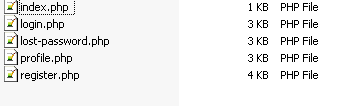
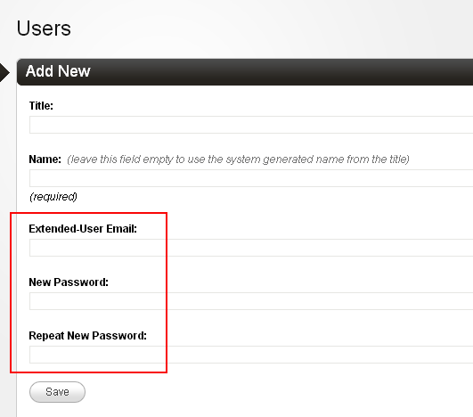
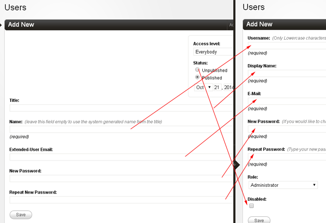

# Extended Users

## Intro

If you have been following Couch's development in recent times, you must have certainly realized that with the advent of features like 'relations' , 'front-end submissions' and 'custom admin theme', Couch is slowly getting to the point where we can use it to create pretty complex 'vertical' applications e.g. a full-fledged e-commerce solution or even forums.

However, the one missing feature that had always prevented this from happening was a proper user-login/registration addon.

The beauty of present implementation is that it uses a regular Couch template for creating user-accounts but, importantly, the cloned pages do not try to 'simulate' the existing Users. Instead, they 'extend' them. To do so, we simply use a normal clonable template and associate it with system Users section. As each user-account is basically only a regular cloned-page, this approach places the full gamut of Couch's existing features at its disposal.

For example, —<br>
a. We can define any number/type of editable regions (i.e. custom fields) to hold user-data. So if your site decides to follow Facebook in allowing users to identify themselves using 51 gender types - no sweat :)<br>
b. We can use the 'relationship' feature to relate 'users' with other cloned pages e.g. posts, likes, videos, etc.<br>
c. We can use the full power of cms:pages tag to list users slicing and dicing through the custom fields.

This should make it a breeze for anyone to implement a full-fledged user login/registration using their own designs.

## Installation

The process remains the same as all addons.

Navigate to the 'couch/addons' folder and find a folder named 'extended'. It is a part of default CouchCMS distro so give a visit to the [**CouchCMS - Download**](https://www.couchcms.com/products/) page if something's amiss.

Activate the addon by uncommenting (or adding if not found) the following line in 'couch/addons/kfunctions.php' file (fresh installations will have a file named `kfunctions.example.php` - this should be renamed to `kfunctions.php`).

```php
require_once( K_COUCH_DIR.'addons/extended/extended-users.php' );
```

That completes the installation.

# Impementation

A sample implementation of extended-users is attached with this post:

### Download [**users.zip**](img/users.zip)

---

N.B. this is just a 'sample' and the markup used has been deliberately kept minimal so as not to lose focus from the code.
It is expected that, once you undesrtand how things work, you'll use your own design in the templates.

Extracting the zip will yield a folder named 'users'. Place this folder within your site's root (NOT **couch**'s root, mind you).

You'll find within the folder some regular front-end Couch templates (5 to be exact).



---

NOTE: The templates found in the 'users' folder are only meant to show a sample implementation of all functions provided by this addon. As such, they use only bare-essential markup. You are expected to use your own markup once you understand how things work.

The names and locations of these templates are configurable from the 'addons/extended/config.php' file but while playing around with the addon for the first time it is recommended you go with the current settings.

---


A short explanation of what each template implements -

### 1. users/index.php

This is the main template that 'extends' the native user accounts.

It serves two purposes –

a. All editable regions defined within this template will become part of the user accounts. This can be used to add any number of custom fields to users e.g. sex, qualification, address etc.<br>
b. Each cloned page created from this template will automatically create and get associated with a user account. This can be used to create user accounts from the front-end using DataBound Forms.

If your site does not require any of the two above-mentioned features, you can skip implementing this template.

> NOTE: The access level of all accounts created from the front-end will always be 'Authenticated User' (i.e. having 'k_user_access_level' of *2*). Which means that these accounts will not have the privilege to access the admin-panel. This restriction is by design.


### 2. users/register.php

This template can be used to allow creation/activation of user accounts from the front-end.

It implements a simple DataBound Form that creates cloned pages of the main 'users/index.php' template mentioned above (remember, doing so results in the creation of a user account). As such, it can only be used if you have chosen to implement the 'users/index.php' template.

If your site does not provide a 'register account' functionality to visitors, you can skip implementing this template.

### 3. users/login.php

This template may be used to create your own custom login/logout page (logout has no GUI).

Please keep in mind that this template completely replaces the default Couch login/logout screens.

If you choose not to implement it, the default login/logout functions of Couch will continue to work as usual (even with the user accounts created using the users/index.php template above).

### 4. users/lost-password.php

This template may be used to create your own custom lost/reset password pages (reset has no GUI).

Just like the login template above, this template is meant to replace the default Couch lost/reset password page.

If you choose not to implement it, the default functions will continue to work as usual.

### 5. users/profile.php

This template can be used to allow users to edit their own profiles form the front-end.

This, again, is just a regular DataBound Form that edits the cloned-page (of 'users/index.php') associated with the currently logged-in user. As explained before, this results in transparently editing the actual user account.

As you can see, you can selectively choose to implement only those templates that your site requires.<br>
For this tutorial, I'll assume we are implementing all of them.<br>
Let us begin with the 'users/index.php' template.

## User accounts

### users/index.php

This template, as all other mentioned above, is just a regular Couch template and so, as per usual, the first step in implementing it is to register it.

To repeat the obvious - login into the admin-panel as super-admin and then in the same browser (or another tab of it), type `http://www.yoursite.com/users/index.php` in the address bar (replacing the `www.yoursite.com` with your site's URL, of course). This will execute the template and register it. Coming back to the admin-panel and refreshing it should show the template's name in the sidebar (if the name does not show up in the sidebar, something is wrong and the template has not been registered).

Unpublish the default-page to get it out of the way.

At this point, we have our user template ready but one last step remains before we can use to create/extend user accounts. You'll find a file named `config.sample.php` within 'couch/addons/extended/' folder. Rename it to `config.php`. Open it up in your text editor and specify the name of our user template (i.e. 'users/index.php') as value of the 'users_tpl' setting as follows

Before:
```php
// Names of the required templates
$t['users_tpl'] = '';
$t['login_tpl'] = '';
$t['lost_password_tpl'] = '';
$t['registration_tpl'] = '';
```

After:
```php
// Names of the required templates
$t['users_tpl'] = 'users/index.php';
$t['login_tpl'] = '';
$t['lost_password_tpl'] = '';
$t['registration_tpl'] = '';
```

Please note that registering all our templates (except users/profile.php) is a two-step procedure -
1. the usual registeration involving visiting the template as super-admin though the browser.
2. specifying the template in couch/addons/extended/config.php file.

---

**V.IMP:** please make sure that you **specify a template's name in the config file only after the template has been registered** with Couch (i.e. its name appears in the admin-panel's sidebar).

---

Finally it's time to see the 'extended' module in action.

Visit 'users/index.php' as super-admin one last time for it to pick up the change we made to the config file above.

Create a cloned page from our 'users/index.php' template.<br>
You'll see that it displays some editable regions that are not defined in the template



---

If at this point (i.e. while trying to create a cloned page from users/index.php) the following error is encountered -
```txt
ERROR: Extended Users module - please visit 'users/index.php' as super-admin to define all required fields
```
&mdash; it'd mean that you missed the step of visiting the template as super-admin after adding it to the config file. Please do so using the browser and now you should be able to create the cloned pages.

---

These automatically added regions help in inputting the email and password data essential for creating a user.

Input some data and save the page. Once the page is created, visit the 'Users' section (i.e. where the real user accounts are listed). You should see that a new user account has been created that has the same data as the cloned page we created above.

Try making changes to the automatically created user-account (e.g. change the email address) and you'll find that its counterpart cloned-page automatically picks up the modifications. Conversely, change something in the cloned-page and the modifications should automatically show up in the associated user account (e.g. try defining a new editable region and that would also show up in the user account).

So in a sense, the two (i.e. the cloned page of users/index.php and the user account it automatically created) have become one. No matter which of the two is changed, the changes appear in both.

Delete a user account and the associated cloned-page gets deleted automatically (the reverse, though, does not happen i.e. deleting a cloned-page will ***not*** delete the associated user-account. This is by design to prevent accidental deletions of precious user-accounts)

> You'll notice that the default user-account created by Couch at installation (the 'super-admin') does not, yet, have a counterpart cloned-page. Click on the account to open its edit screen and press 'save'. Doing so will create its associated cloned-page.

If, at this point, you still find yourself wondering why we need to take this round-about route of accessing user accounts via cloned-pages, please remember that by doing so the full gamut of Couch's features e.g. to name a few -

a. support for DataBound forms that allow normal users to create/edit cloned pages from the site's front-end<br>
b. ability to define any number of custom-fields<br>
c. availability of cms:pages tag to slice and dice all pages<br>
d. 'relations' feature to associate pages from different templates<br>
e. in-place editing<br>

&mdash; basically everything that hitherto applied only to cloned-pages, now applies to user accounts as well. *Plus* everything we knew about working with user-accounts from the very first version of Couch ([**Core Concepts - Users and Access Control**](http://www.couchcms.com/docs/concepts/users.html)), still holds good.

Moving on, now that we know that cloned-pages of our users/index.php template have given us a handle to the real user accounts, we can implement the other templates. Let us try using DataBound Forms to create (register) user accounts from the front-end next.

## Register/Activate account

### users/register.php

As we did with the first template we implemented, register the users/register.php by visiting it as super-admin. Once it shows up in the admin-panel, specify its name in the 'couch/addons/extended/config.php' file as follows -

```php
// Names of the required templates
$t['users_tpl'] = 'users/index.php';
$t['login_tpl'] = '';
$t['lost_password_tpl'] = '';
$t['registration_tpl'] = 'users/register.php';
```

The code within the template should be pretty easy to follow but I'll point out the important parts of it.

As mentioned before, this template handles two functions
a. creating new user-accounts from the front-end (i.e. provide the 'register account' functionality to visitors)<br>
b. activating the accounts created above (if we chose to create them in a disabled state).

The creation of a new account simply involves creating a regular cloned-page and this is done using a regular DataBound Form.

> If you happen to be unfamiliar with DataBound Forms, please first take a look at [**Core Concepts - DataBound Forms**](https://docs.couchcms.com/concepts/databound-forms.html) as this sections builds entirely on that feature.]

This is how the DataBound form is defined -
```xml
<cms:form
    masterpage=k_user_template
    mode='create'
    ..
    ..
```
The 'create' mode specifies that submitting this form will result in creation of a cloned page from the template specified in the 'masterpage' parameter.

> Speaking of which, please notice that the 'masterpage' parameter is set to a variable named 'k_user_template'. This actually resolves to 'users/index.php' i.e. the template that we have used to create the 'proxy' user accounts. For code portability, Couch fetches the names of the templates specified in the config file and makes them available as variables. '**k_user_template**' is one of them. The others being
   * **k_user_login_template**
   * **k_user_lost_password_template**
   * **k_user_registration_template**


Next let us take a look at the body of the form.
You'll find that it consists, as expected in a DBFs, of 'bound' fields.
```xml
DisplayName:<br />
<cms:input name='k_page_title' type='bound' /><br />

Email Address:<br />
<cms:input name='extended_user_email' type='bound' /><br />

Password:<br />
<cms:input name='extended_user_password' type='bound' /><br />

Repeat Password:<br />
<cms:input name='extended_user_password_repeat' type='bound' /><br />
```

The 'extended_user_email', 'extended_user_password' and 'extended_user_password_repeat' fields are special in the sense that we have not defined them in the template - Couch has automatically added them to the users/index.php template.

Let us see how the various fields of the cloned-page map to user-accounts.



The 'extended_user_email', 'extended_user_password' and 'extended_user_password_repeat' map to the 'E-Mail', 'New Password' and 'Repeat Password' system fields seen while editing any user account.

The 'k_page_title' field maps to the 'Display Name'.

The other fields of our cloned-page that map to the user-account are 'k_page_name' and 'k_publish_date'. 'k_page_name' maps to 'Username' while 'k_publish_date' is a little unusual in that it maps to 'Disabled' - the idea is that by unpublishing a cloned-page, we disable the associated user account. We are not using these last two fields in the form itself, but we'll make use of them directly when we save the form later.

In addition to the mentioned system fields, If you choose to define your own custom fields in the 'users/index.php' template, those can be added to the form as 'bound' fields - this is regular DBF stuff.

As with all DBFs, the action lies in the success condition of the form where we use cms:db_persist_form tag to push the submitted values into a cloned-page. In our template, that portion looks like this -
```xml
<cms:db_persist_form
    _invalidate_cache='0'
    k_page_name = "<cms:random_name />"
    k_publish_date = '0000-00-00 00:00:00'
/>
```
Please notice the way 'k_page_name' is being set to a random string above.
As mentioned above, 'k_page_name' will become the 'Username' i.e. the string that can be used (along with the password) to login. Obviously, this should be unique. But then why are we setting it to a random value instead of providing an input in the form for the visitor to fill in?

We certainly can, if so we want, provide a field 'bound' to 'k_page_name' and let the visitor specify his unique account name. However, remember that every user account mandates a unique email as well. This email can also be used to login so basically now every user will have two unique values that can be used for logging in - the 'name' and the 'email'.

For accounts created from the front-end, it can be a good idea to use only the email for login. The required 'k_page_name' can simply be set to a unique random value to satisfy Couch's requirements and done away with. This is what we are doing. If your use-case demands otherwise, feel free to make the changes.

Next, notice the 'k_publish_date' date being set to '0000-00-00 00:00:00'.
This special date is used by Couch for 'unpublished' cloned-pages. So, the page we are creating will be in an unpublished state and, as mentioned above, this will lead to the creation of a user-account in a 'disabled' state.

In our code, as is the accepted convention, when a visitor creates her account, that account cannot be used right away for logging in. To prevent spam account creation, we send the user an activation link via email instead. It is when the user visits our template using the sent link that we remove the 'disabled' status from the account.

This is done by the following portion of the code where we use 'cms:activation_link' tag to get the activation link and then send it via email -
```xml
<cms:send_mail from="<cms:php>echo K_EMAIL_FROM;</cms:php>" to=frm_extended_user_email subject='New Account Confirmation' debug='1'>
    Please click the following link to activate your account:
    <cms:activation_link   frm_extended_user_email   />

    Thanks,
    Website Name
</cms:send_mail>
```
With the email dispatched, our template sets a 'session variable' (i.e. variables that remain available only for a single refresh of the page) to indicate the success condition and redirects to itself (i.e. refreshes the page)
```xml
<cms:set_flash name='success_msg' value='1' />
<cms:redirect k_page_link />
```

Upon refreshing, the following code that begins the template senses the success_msg session variable set above and displays the relevant message to the user -
```xml
<!-- are there any success messages to show from previous actions? -->
<cms:set success_msg="<cms:get_flash 'success_msg' />" />
<cms:if success_msg >
    <div class="notice">
        <cms:if success_msg='1' >
            Your account has been created successfully and we have sent you an email.<br />
            Please click the verification link within that mail to activate your account.
            ..
            ..
```
That completes part one of the use-case (i.e. registration).
The second part (i.e. activation) will kick in when the user visits this template using the activation link we emailed her.

We handle this activation part as follows using the cms:process_activation tag -
```xml
<!-- is the visitor here by clicking the account-activation link we emailed? -->
<cms:if action='activate' >
    <h1>Activate account</h1>

    <cms:process_activation />
    ..
    ..
```
The setting of success message and subsequent redirection that follows should be familiar to you now.

That completes our tour through the code in 'users/register.php' template.
Next we implement the 'Login/Logout' functionality through 'users/login.php;

## Login/Logout

### users/login.php

Compared to the last template (users/register.php), the users/login.php is rather simple to implement. We begin by the registration process common to all these templates.

Visit users/login.php as super-admin and, once the template appears in the admin-panel, specify its name in the config file -
```php
// Names of the required templates
$t['users_tpl'] = 'users/index.php';
$t['login_tpl'] = 'users/login.php';
$t['lost_password_tpl'] = '';
$t['registration_tpl'] = 'users/register.php';
```
This template, similar to the registration template, handles two distinct (albeit related) tasks -
a. showing and processing the login form<br>
b. processing the logout URL

The login form is a regular Couch form.
What makes it special are the names of the cms:input fields within it -
```html
Username: <br/>
<cms:input type='text' name='k_user_name' /> <br/>

Password: <br />
<cms:input type='password' name='k_user_pwd' /> <br/>

<!-- if 'remember me' function is not required, the following checkbox can be omitted -->
<cms:input type='checkbox' name='k_user_remember' opt_values='Remember me=1' /> <br/>

<input type="hidden" name="k_cookie_test" value="1" />
```
This login form expects input fields named 'k_user_name', 'k_user_pwd' and (optionally) 'k_user_remember', 'k_cookie_test' within it.

Upon successful submission of the form, the success block invokes a tag named cms:process_login that does all the required processing.
```xml
<cms:if k_success >
    ..
    <cms:process_login />

</cms:if>
```
In contrast to login, the logout function does not require a form and simply examines the URL to see if it is being called -
```xml
<cms:if action='logout' >
    <cms:process_logout />
<cms:else />
    ..
```
The cms:process_logout tag is what processes the logout.

And that is all that we need to know about login/logout (I said this was going to be simple :) ).
Next we implement the Forgot/Reset password functionality using the 'users/lost-password.php' template.

## Forgot/Reset password

### users/lost-password.php

The usual registration step first -<br>
Visit users/lost-password.php as super-admin and, once the template appears in the admin-panel, specify its name in the config file -

```php
// Names of the required templates
$t['users_tpl'] = 'users/index.php';
$t['login_tpl'] = 'users/login.php';
$t['lost_password_tpl'] = 'users/lost-password.php';
$t['registration_tpl'] = 'users/register.php';
```

Take a look at the code in this template and you'll find that it is quite similar to the 'users/login.php' template we implemented above - e.g.
1. implements two related functions - forgot-password and reset-password.
2. one of the two functions (namely forgot-password) uses form while the other (reset-password) relies on URL.
3. the form used expects cms:input with a specific name.

The only requirement of the form is an input named 'k_user_name'
```xml
Your E-mail: <br/>
<cms:input type='text' name='k_user_name' /><br/>
```
A user can input either her username or her email address in this form but, as we have seen in the registration section, we are using random names as usernames. Hence the prompt says 'Your E-mail'.

As with all forms, it is the success block that sees all the action -
```xml
<cms:if k_success>

    <!-- the 'process_forgot_password' tag below expects a field named 'k_user_name' -->
    <cms:process_forgot_password />
    ..
```
The cms:process_forgot_password tag processes the submitted email address (or username) and, if it finds a valid account by that credential, generates and sends an email to the address associated with that account (this is to ensure that the account holder is really the person requesting the password reset).

The sent email contains a link pointing back to this very template (but with some encrypted data attached to prevent tampering).
If the user visits the template using the link sent above, the cms:process_reset_password tag comes kicks in, resets the password and emails the new password back to the user -
```xml
<cms:if action='reset' >
    <h1>Reset Password</h1>

    <cms:process_reset_password />
    ..
```
One thing you'll surely notice in the code is that, although it is sending email twice, there is no cms:send_mail code anywhere. So what gets sent in the emails?

The answer lies in 'couch/lang/EN.php' (or whichever language file your site is configured to use). You'll find the strings used in the emails under the "Password recovery" heading e.g.
```php
$t['reset_req_email_subject'] = 'Password reset requested';
$t['reset_req_email_msg_0'] = 'A request was received to reset your password for the following site and username';
$t['reset_req_email_msg_1'] = 'To confirm that the request was made by you please visit the following address, otherwise just ignore this email.';
```
This is to maintain backward compatibility with the existing native Forgot/Reset password functions in Couch (i.e. those that you reach via 'Forgot Password?' link below the native login box).

If, however, you'd prefer to put the email text right in the template, both the 'cms:process_forgot_password' and 'cms:process_reset_password' tags can be instructed not to send the emails and then we can do so ourselves.
Following is a sample of how it could be done -
```xml
<cms:if action='reset' >
    <h1>Reset Password</h1>

    <cms:process_reset_password
        send_mail='0'
    />

    <cms:if k_success >
        <cms:send_mail from='admin@mysite.com' to=k_user_email subject='Your new password' debug='0'>
            Your password has been resetted for the following site and username:
            <cms:show k_site_link />
            Username: <cms:show k_user_name />

            New Password: <cms:show k_user_new_password />

            Once logged in you can change your password.
        </cms:send_mail>

        <cms:set_flash name='success_msg' value='2' />
        <cms:redirect k_page_link />

    <cms:else />
        <cms:show k_error />
    </cms:if>

<cms:else />
..

```
```xml
<h1>Forgot Password</h1>

<cms:form method="post" anchor='0'>
    <cms:if k_success>

        <!-- the 'process_forgot_password' tag below expects a field named 'k_user_name' -->
        <cms:process_forgot_password
            send_mail='0'
        />

        <cms:if k_success>
            <cms:send_mail from='admin@mysite.com' to=k_user_email subject='Password reset requested' debug='0'>
                A request was received to reset your password for the following site and username:
                <cms:show k_site_link />
                Username: <cms:show k_user_name />

                To confirm that the request was made by you please visit the following address, otherwise just ignore this email.
                <cms:show k_reset_password_link />
            </cms:send_mail>

            <cms:set_flash name='success_msg' value='1' />
            <cms:redirect k_page_link />
        </cms:if>
    </cms:if>
    ..
```
With that we have implemented all the core templates used by extended-users module.
Let us finish things off by implementing the last remaining template.

## Edit Profile

### users/profile.php

Strictly speaking, this template has nothing to do with the extended-users module. It simply allows a logged-in user to edit her own profile using a DataBound Form.

I don't think you'll have any difficulty in following its code but would still like to draw your attention to certain parts of it.

The template begins by a very generic check that can be put in any secured page -
```xml
<!-- this is secured page. login first to access it -->
<cms:if k_logged_out >
    <cms:redirect "<cms:login_link />" />
</cms:if>

<!-- someone who manages to reach here is certainly a logged-in user -->
..
```
The DataBound Form that follows edits the cloned-page of 'users/index.php' that now serves as a 'proxy' for the real user account -
```xml
<cms:form
    masterpage=k_user_template
    mode='edit'
    page_id=k_user_id
    enctype="multipart/form-data"
    method='post'
    anchor='0'
    >
```
The 'masterpage' parameter is set to the variable named 'k_user_template' (which, as already discussed, resolves to 'users/index.php' in our case).

Notice the 'page_id' parameter that expects the 'id' of the cloned-page being edited. We have set it to the variable 'k_user_id'. This variable is always set to the 'id' of the currently logged-in user, which in turn maps to the cloned-page representing the account.

Rest of the code is pretty regular. If you have defined new editable regions in the 'users/index.php', those can be added as 'bound' inputs.

As an aside, since the topic of custom editable regions has come up, suppose we have defined some new regions in the user template e.g. 'avatar', 'sex', 'DOB' etc. How do we display the values of these regions associated with a particular user (e.g. the currently logged-in user) on other pages of the site?

You probably would have guessed the answer - it is our trusty cms:pages tag. E.g. the following code will display all the data about the current logged-in user
```xml
<cms:if k_logged_in >
    <cms:pages masterpage=k_user_template id=k_user_id limit='1'>
        <cms:dump />
    </cms:pages>
</cms:if>
```
The key is the 'masterpage' parameter set to our user template and the 'id' parameter set to current logged-in user (we have placed the cms:pages block within the 'k_logged_in' check because 'k_user_id' is available only if the user is logged in).

As another example, the same cms:pages loop can be modified to show data about all registered users
```xml
<cms:pages masterpage=k_user_template limit='50' paginate='1'>
    <cms:dump />

    <cms:paginator />
</cms:pages>
```

## Summary

To wrap up our discussion on extended-users module, here is a list of all the tags introduced by it along with the functions they implement -

|       function   |  tag  |
|-----------------:|:-------------|
| Login            | [**cms:process_login**](../../tags-reference/Extended-Users/process_login.md) |
| Logout           | [**cms:process_logout**](../../tags-reference/Extended-Users/process_logout.md) |
| Forgot Password  | [**cms:process_forgot_password**](../../tags-reference/Extended-Users/process_forgot_password.md) |
| Reset password   | [**cms:process_reset_password**](../../tags-reference/Extended-Users/process_reset_password.md) |
| Register Account | does not require a dedicated tag |
| Activate account | [**cms:process_activation**](../../tags-reference/Extended-Users/process_activation.md) |

---

### Download [**users.zip**](img/users.zip)
