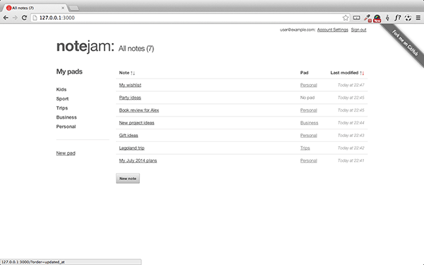
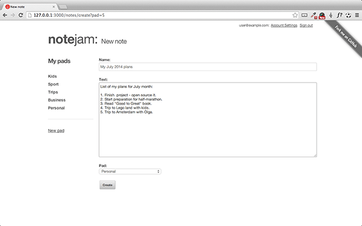
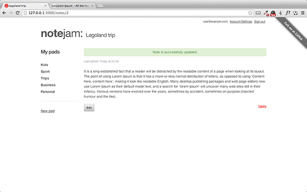

Table of Contents

* [Intro](https://github.com/trendoman/Midware/tree/main/tutorials/Notejam-App/01-Intro.md#intro)
* [Installing the application](https://github.com/trendoman/Midware/tree/main/tutorials/Notejam-App/02-Installing-the-application.md#installing-the-application)
* [Code Walkthrough](https://github.com/trendoman/Midware/tree/main/tutorials/Notejam-App/03-Code-Walkthrough.md#code-walkthrough)
   * [Notes](https://github.com/trendoman/Midware/tree/main/tutorials/Notejam-App/04-Notes.md#notes)
   * [Routes](https://github.com/trendoman/Midware/tree/main/tutorials/Notejam-App/05-Routes.md#routes)
   * [Filters](https://github.com/trendoman/Midware/tree/main/tutorials/Notejam-App/06-Filters.md#filters)
   * [Controller](https://github.com/trendoman/Midware/tree/main/tutorials/Notejam-App/07-Controller.md#controller)
   * [Views](https://github.com/trendoman/Midware/tree/main/tutorials/Notejam-App/08-Views.md#views)
       1. [List view](./09-List-View.md#views--notes-list-view)
       2. [Page view](https://github.com/trendoman/Midware/tree/main/tutorials/Notejam-App/10-Page-View.md#views--notes-page-view)
       3. [Create view](https://github.com/trendoman/Midware/tree/main/tutorials/Notejam-App/11-Create-View.md#views--notes-create-view)
       4. [Create view (with pad)](https://github.com/trendoman/Midware/tree/main/tutorials/Notejam-App/12-Create-View-(with-Pad).md#views--notes-create-view-with-pad)
       5. [Edit view](https://github.com/trendoman/Midware/tree/main/tutorials/Notejam-App/14-Edit-View.md#views--notes-edit-view)
       6. [Delete view](https://github.com/trendoman/Midware/tree/main/tutorials/Notejam-App/15-Delete-View.md#views--notes-delete-view)
   * [Pads](https://github.com/trendoman/Midware/tree/main/tutorials/Notejam-App/16-Pads.md#pads)
   * [Users](https://github.com/trendoman/Midware/tree/main/tutorials/Notejam-App/17-Users.md#users)
* [Wrapping up..](https://github.com/trendoman/Midware/tree/main/tutorials/Notejam-App/18-Wrapping-up.md#wrapping-up)

# Intro

In this tutorial we'll bring together some of the more advanced features of Couch like ['relations'](http://www.couchcms.com/docs/concepts/relationships.html), ['data-bound forms'](http://www.couchcms.com/docs/concepts/databound-forms.html), ['extended users'](https://github.com/trendoman/Midware/tree/main/concepts/Extended-Users#extended-users) and ['custom routes'](https://github.com/trendoman/Midware/tree/main/concepts/Custom-Routes#custom-routes) to create a, not-so-simple, 'application' (as opposed to a regular site that Couch is usually used for).

So what shall we be building?\
Please take a look at [https://github.com/komarserjio/notejam](https://github.com/komarserjio/notejam) for that.

Notejam is a unified sample web application implemented using different server-side frameworks (like Laravel, Yii etc.). In this tutorial, we'll attempt to implement it using [**CouchCMS**](https://github.com/CouchCMS/CouchCMS).

Broadly speaking, following is what this sample application does (details can be found at [https://github.com/komarserjio/notejam/application-overview](https://github.com/komarserjio/notejam/blob/master/contribute.rst#application-overview)) -

1. Visitors can sign up/in/out.
2. Logged-in users can create/view/edit/delete their own 'notes'.
3. The notes can be grouped in 'pads' (functionally equivalent to our 'folders' but user specific).
4. Logged-in users can create/view/edit/delete their own 'pads'.

For this tutorial, instead of starting off with a blank slate and developing the features step-by-step (as done in our first tutorial at [http://www.couchcms.com/docs/tutorials/portfolio-site/](http://www.couchcms.com/docs/tutorials/portfolio-site/)), we'll take a different approach - we'll start with a fully developed and functional application and then analyze it by going through all its code line-by-line.

Here is the static HTML design of Notejam application\
[**HTML version**](Notejam-static-HTML.zip)

And here is its completely "Couchified" version -\
[**Couchified version**](Notejam-Couchified.zip)

Before we begin our tour through this application's codebase to see how it was implemented using Couch, I think you'd find it helpful to have it up and running on your local system. This way you can explore its functionality first-hand as we discuss the code behind it.

So please bear through this, unavoidably bland, preparatory step of installing a working copy of Notejam on your system before we dive into its code which is where all the excitement lies

---

**Next: [Installing the application →](https://github.com/trendoman/Midware/tree/main/tutorials/Notejam-App/02-Installing-the-application.md#installing-the-application)**
