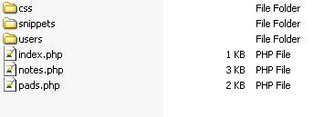
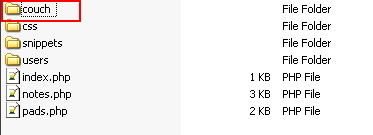
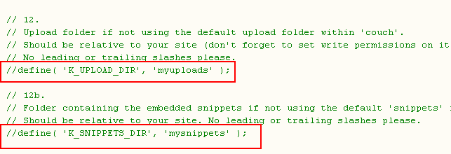
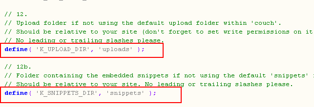
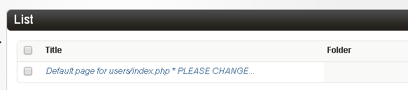

<details><summary>Table of Contents</summary>

* [Intro](https://github.com/trendoman/Midware/tree/main/tutorials/Notejam-App/01-Intro.md#intro)
* [Installing the application](https://github.com/trendoman/Midware/tree/main/tutorials/Notejam-App/02-Installing-the-application.md#installing-the-application)
* [Code Walkthrough](https://github.com/trendoman/Midware/tree/main/tutorials/Notejam-App/03-Code-Walkthrough.md#code-walkthrough)
   * [Notes](https://github.com/trendoman/Midware/tree/main/tutorials/Notejam-App/04-Notes.md#notes)
   * [Routes](https://github.com/trendoman/Midware/tree/main/tutorials/Notejam-App/05-Routes.md#routes)
   * [Filters](https://github.com/trendoman/Midware/tree/main/tutorials/Notejam-App/06-Filters.md#filters)
   * [Controller](https://github.com/trendoman/Midware/tree/main/tutorials/Notejam-App/07-Controller.md#controller)
   * [Views](https://github.com/trendoman/Midware/tree/main/tutorials/Notejam-App/08-Views.md#views)
       1. [List view](./09-List-View.md#views--notes-list-view)
       2. [Page view](https://github.com/trendoman/Midware/tree/main/tutorials/Notejam-App/10-Page-View.md#views--notes-page-view)
       3. [Create view](https://github.com/trendoman/Midware/tree/main/tutorials/Notejam-App/11-Create-View.md#views--notes-create-view)
       4. [Create view (with pad)](https://github.com/trendoman/Midware/tree/main/tutorials/Notejam-App/12-Create-View-(with-Pad).md#views--notes-create-view-with-pad)
       5. [Edit view](https://github.com/trendoman/Midware/tree/main/tutorials/Notejam-App/14-Edit-View.md#views--notes-edit-view)
       6. [Delete view](https://github.com/trendoman/Midware/tree/main/tutorials/Notejam-App/15-Delete-View.md#views--notes-delete-view)
   * [Pads](https://github.com/trendoman/Midware/tree/main/tutorials/Notejam-App/16-Pads.md#pads)
   * [Users](https://github.com/trendoman/Midware/tree/main/tutorials/Notejam-App/17-Users.md#users)
* [Wrapping up..](https://github.com/trendoman/Midware/tree/main/tutorials/Notejam-App/18-Wrapping-up.md#wrapping-up)
</details>

# Installing the application

If not already downloaded, please get the [**Notejam-Couchified.zip**](Notejam-Couchified.zip) now.

It is a zip file, extracting which will yield a folder named 'site'. Place the contents of the folder (i.e. excluding the 'site' folder itself) into your webserver's root.



Important files are our templates (the 'users' folder contains templates concerned with user accounts, login, registration etc.) and the 'snippets' folder that contains much of our application logic (we'll see all that in detail soon).

Notice that there is no 'couch' folder in there yet.

Please download the [**latest version of Couch**](https://www.couchcms.com/products/) and place the 'couch' folder within the site's root



Rename `couch/config.example.php` to `couch/config.php` and add to it the required database information. Important to this tutorial, edit the following settings from



to



As can be seen, we are changing the default locations of 'uploads' and 'snippets' folder from within the 'couch' folder to directly beneath the site's root. The 'snippets' folder, as we saw before, is already present in the site's root. The 'uploads' folder will get created automatically when we upload any asset through Couch.

With the changes made to the config file, access ***http:​//www​.yoursite​.com/couch*** to complete Couch's installation.

Once Couch is installed, let us activate the addons that will be used by our application.

Rename `couch/addons/kfunctions.example.php` to `couch/addons/kfunctions.php` and then uncomment (i.e. remove the leading double-slashes '//') from the following lines within the file -

```php
//require_once( K_COUCH_DIR.'addons/extended/extended-users.php' );
//require_once( K_COUCH_DIR.'addons/routes/routes.php' );
```

We can now move on to registering our templates.

**Register templates:**

As mentioned before, the Notejam application comprises of three distinct 'entities' - '**users**', '**notes**' and '**pads**'. As is the norm with Couch, we use clonable templates to represent each of these entities. The ***notes.php*** and ***pads.php*** templates can be found in the site's root while the users template can be found within the 'users' folders as ***index.php***.

We'll begin with registering the users template (***users/index.php***) first as the other two templates will refer to this in their relation fields.

**Users template:**

This part of our application has been built using the 'extended-users' module ([Extended Users](https://github.com/trendoman/Midware/tree/main/concepts/Extended-Users#extended-users)).

Take a look at the 'users' folder and you'll find that it contains all the templates that the 'extended-users' module requires to implement the various staple functionalities of a user registration system e.g. login, logout, reset-password etc.

For now, we'll concern ourselves only with the ***users/index.php*** template as this is the one the cloned pages of which will represent our user accounts. The rest of the templates can be registered and used after our application is complete as the default functions that ship with Couch (e.g. login, logout etc.) will suffice during the development period.

The process of setting up the user accounts template is described in detail in the docs ([User accounts](https://github.com/trendoman/Midware/tree/main/concepts/Extended-Users#usersindexphp)) but I'll repeat the steps here for the sake of completeness -

1. Register ***users/index.php*** by visiting ***http:​//www​.yoursite​.com/users/index.php*** as super-admin.

2. Coming back to the admin-panel, rename its default page to ***'DO NOT DELETE'*** and unpublish it.\*

   

   

   > NOTE: You might remember that if the default page is deleted, Couch recreates it automatically and seeing a strangely named ('Default page for users/index.php \* PLEASE CHANGE THIS TITLE \*') page suddenly appear in listings could be disconcerting to the site-owner.
   >
   > By unpublishing and clearly stating not to delete this page, we avoid this scenario. This is a good practice for all clonable templates and we'll follow the same for the other templates too.

3. Rename `couch/addons/extended/config.example.php` to `couch/addons/extended/config.php` and add ***'users/index.php'*** to the following setting

   ```php
   // Names of the required templates
   $t['users_tpl'] = 'users/index.php';
   ```

   This will make the module use cloned pages of this template as user accounts.

4. Visit ***http:​//www​.yoursite​.com/users/index.php*** as super-admin once again. Doing so will cause the 'extended-users' module to add all the required editable regions to our template.

5. Check that every thing works as expected by coming back to the admin-panel and creating a cloned page from the template. This should cause an equivalent user account to be created automatically. Open the super-admin account for editing and simply hit 'save' without changing anything. This should cause an equivalent cloned-page to be created in the users template.

Our users template is now completely configured and we can forget it for now and turn our attention to the other two templates.

**Notes and Pads templates:**

Fortunately, registering these templates is a much simpler affair.

Visit ***http:​//www​.yoursite​.com/pads.php*** as super-admin and then visit ***http:​//www​.yoursite​.com/notes.php*** (the sequence is important as a relation field within ***notes.php*** references ***pads.php***).

Coming back to the admin-panel, you should see the two templates appear in the sidebar along with the user template we registered before them.

**Add some test data:**

Before we move onto the front-end to work directly with the application, create some 'seeding' data for the application. To do so, use the admin-panel to create a couple of pads (i.e. cloned-pages of ***pads.php***). Associate them with 'admin' for now. Now create some notes and associate them with the pads we created above and user 'admin'.

Unpublish the default pages of both the templates, as we did with the users template above.

The application is ready to be tested.

Visit ***http:​//www​.yoursite​.com/notes.php*** and you should see the notes and pads we created above. Try creating some new pads and notes and editing/deleting them.

Create a new user (for now from the admin-panel). Logoff as admin and login as the new user. The pads/notes belonging to the admin will not be shown to the new user. Try creating some notes and pads for this user.

With the working application at hand, time to finally explore the code that created it.

---

**Next: [Code Walkthrough →](https://github.com/trendoman/Midware/tree/main/tutorials/Notejam-App/03-Code-Walkthrough.md#code-walkthrough)**
