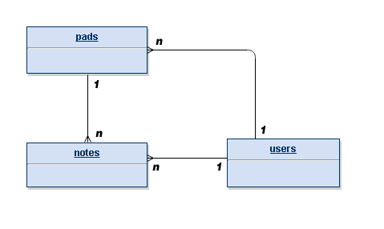

Table of Contents

* [Intro](https://github.com/trendoman/Midware/tree/main/tutorials/Notejam-App/01-Intro.md#intro)
* [Installing the application](https://github.com/trendoman/Midware/tree/main/tutorials/Notejam-App/02-Installing-the-application.md#installing-the-application)
* [Code Walkthrough](https://github.com/trendoman/Midware/tree/main/tutorials/Notejam-App/03-Code-Walkthrough.md#code-walkthrough)
   * [Notes](https://github.com/trendoman/Midware/tree/main/tutorials/Notejam-App/04-Notes.md#notes)
   * [Routes](https://github.com/trendoman/Midware/tree/main/tutorials/Notejam-App/05-Routes.md#routes)
   * [Filters](https://github.com/trendoman/Midware/tree/main/tutorials/Notejam-App/06-Filters.md#filters)
   * [Controller](https://github.com/trendoman/Midware/tree/main/tutorials/Notejam-App/07-Controller.md#controller)
   * [Views](https://github.com/trendoman/Midware/tree/main/tutorials/Notejam-App/08-Views.md#views)
       1. [List view](./09-List-View.md#views--notes-list-view)
       2. [Page view](https://github.com/trendoman/Midware/tree/main/tutorials/Notejam-App/10-Page-View.md#views--notes-page-view)
       3. [Create view](https://github.com/trendoman/Midware/tree/main/tutorials/Notejam-App/11-Create-View.md#views--notes-create-view)
       4. [Create view (with pad)](https://github.com/trendoman/Midware/tree/main/tutorials/Notejam-App/12-Create-View-(with-Pad).md#views--notes-create-view-with-pad)
       5. [Edit view](https://github.com/trendoman/Midware/tree/main/tutorials/Notejam-App/14-Edit-View.md#views--notes-edit-view)
       6. [Delete view](https://github.com/trendoman/Midware/tree/main/tutorials/Notejam-App/15-Delete-View.md#views--notes-delete-view)
   * [Pads](https://github.com/trendoman/Midware/tree/main/tutorials/Notejam-App/16-Pads.md#pads)
   * [Users](https://github.com/trendoman/Midware/tree/main/tutorials/Notejam-App/17-Users.md#users)
* [Wrapping up..](https://github.com/trendoman/Midware/tree/main/tutorials/Notejam-App/18-Wrapping-up.md#wrapping-up)

# Code Walkthrough

Let us begin with a bird-eye view of how the three entities comprising Notejam (i.e. users, notes and pads) relate to each other using the following ERD (the 'crow-feet' end if the 'many' end of the relationship)-

The relationships can be summarized in words as follows -

**1. notes and users**

&emsp;A user can have many notes but a note can belong to only one user

**2. pads and users**

&emsp;A user can have many pads but a pad can belong to only one user

**3. notes and pads**

&emsp;A pad can contain many notes but a note can only be within a single pad

Keep these relationships in mind as we now go through the templates and see how they are implemented.

We'll begin with the notes template.

---

**Next: [Notes →](https://github.com/trendoman/Midware/tree/main/tutorials/Notejam-App/04-Notes.md#notes)**
