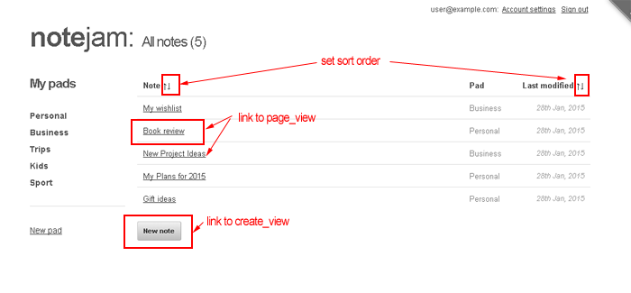

<details><summary>Table of Contents</summary>

* [Intro](https://github.com/trendoman/Midware/tree/main/tutorials/Notejam-App/01-Intro.md#intro)
* [Installing the application](https://github.com/trendoman/Midware/tree/main/tutorials/Notejam-App/02-Installing-the-application.md#installing-the-application)
* [Code Walkthrough](https://github.com/trendoman/Midware/tree/main/tutorials/Notejam-App/03-Code-Walkthrough.md#code-walkthrough)
   * [Notes](https://github.com/trendoman/Midware/tree/main/tutorials/Notejam-App/04-Notes.md#notes)
   * [Routes](https://github.com/trendoman/Midware/tree/main/tutorials/Notejam-App/05-Routes.md#routes)
   * [Filters](https://github.com/trendoman/Midware/tree/main/tutorials/Notejam-App/06-Filters.md#filters)
   * [Controller](https://github.com/trendoman/Midware/tree/main/tutorials/Notejam-App/07-Controller.md#controller)
   * [Views](https://github.com/trendoman/Midware/tree/main/tutorials/Notejam-App/08-Views.md#views)
       1. [List view](./09-List-View.md#views--notes-list-view)
       2. [Page view](https://github.com/trendoman/Midware/tree/main/tutorials/Notejam-App/10-Page-View.md#views--notes-page-view)
       3. [Create view](https://github.com/trendoman/Midware/tree/main/tutorials/Notejam-App/11-Create-View.md#views--notes-create-view)
       4. [Create view (with pad)](https://github.com/trendoman/Midware/tree/main/tutorials/Notejam-App/12-Create-View-(with-Pad).md#views--notes-create-view-with-pad)
       5. [Edit view](https://github.com/trendoman/Midware/tree/main/tutorials/Notejam-App/14-Edit-View.md#views--notes-edit-view)
       6. [Delete view](https://github.com/trendoman/Midware/tree/main/tutorials/Notejam-App/15-Delete-View.md#views--notes-delete-view)
   * [Pads](https://github.com/trendoman/Midware/tree/main/tutorials/Notejam-App/16-Pads.md#pads)
   * [Users](https://github.com/trendoman/Midware/tree/main/tutorials/Notejam-App/17-Users.md#users)
* [Wrapping up..](https://github.com/trendoman/Midware/tree/main/tutorials/Notejam-App/18-Wrapping-up.md#wrapping-up)
</details>

# Views » Notes List View

Take a look at how this view renders on the website and you'll see that it simply lists all the notes belonging to the logged-in user.



The listed notes are also linked to their 'page_views' (where you can see one single note in full) and a 'New note' button at the bottom leads to the 'create_view'.

The listing can also be sorted based on the notes' titles and their modification dates.

As we know, this view is handled by the `views/notes/list_view.html` snippet. Please open it up in your text editor and we'll see how the features mentioned above have been implemented.

The first thing that you'll notice is that the snippet outputs everything within a **cms:capture** tag

```xml
<cms:capture into='my_content' >
    ..
</cms:capture>
```

You'll remember from our previous discussion that this sets the contents within the 'my_content' variable that is then passed on to the main template.

The core of this view is the cms:pages block that fetches all notes belonging to the logged-in user -

```xml
<cms:pages custom_field="note_owner=<cms:show k_user_name />"
   orderby=my_sort_field
   order=my_sort_dir
   show_future_entries='1'>
    ...
</cms:pages>
```

*'Belonging to the logged-in user'* part is enforced by the 'custom_field' parameter of **cms:pages** where we ask it to find only pages that have the 'note_owner' field (the relation field) set to the logged-in user ('k_user_name' always points to the logged-in user)

```xml
custom_field="note_owner=<cms:show k_user_name />"
```

The other parameters of interest in the **cms:pages** block above are these two -

```
orderby=my_sort_field
order=my_sort_dir
```

Instead of hardcoding the orderby field and order values e.g. as follows

```
orderby='modification_date'
order='desc'
```

\- we are making use of variables named 'my_sort_field' and 'my_sort_dir'

By using variables, we can implement the 'sorting' functionality marked out in the screenshot where the listing could be sorted based on either titles or modification dates.

The idea is that before the **cms:pages** block is invoked, we set the 'my_sort_field' and 'my_sort_dir' variables it uses according to the choice made by the user.

The choice is provided by the up/down arrows in the table header e.g.

```xml
<th class="note">
    Note
    <a href="<cms:add_querystring k_page_link 'sort=name' />" class="sort_arrow" >&uarr;</a>
    <a href="<cms:add_querystring k_page_link 'sort=-name' />" class="sort_arrow" >&darr;</a>
</th>

<th class="date">
    Last modified
    <a href="<cms:add_querystring k_page_link 'sort=date' />" class="sort_arrow" >&uarr;</a>
    <a href="<cms:add_querystring k_page_link 'sort=-date' />" class="sort_arrow" >&darr;</a>
</th>
```

The **cms:add_querystring** is simply appending a 'sort=field' or 'sort=-field' to whatever is the current page's URL.

So, if the current URL is ***http:​//www​.yoursite​.com/notes.php***, the links changing the sort order based on name become -

&emsp;***http:​//www​.yoursite​.com/notes.php?sort=name***

&emsp;***http:​//www​.yoursite​.com/notes.php?sort=-name***


while those changing the sort order based on modification dates become

&emsp;***http:​//www​.yoursite​.com/notes.php?sort=date***

&emsp;***http:​//www​.yoursite​.com/notes.php?sort=-date***

If the user clicks on any of these links, the URL will now contain the querystring parameter named 'sort' specifying the field to sort on ('name' or 'date' in examples above) and the direction of the sort (the minus sign will mean 'desc').

In our snippet, just before the **cms:pages** block is called, we invoke a snippet named 'handle_sort.html'. This snippet checks for the querystring parameter 'sort' mentioned above and then sets the 'my_sort_field' and 'my_sort_dir' variables used by **cms:pages** that follows accordingly -

```xml handle_sort
<!-- process sorting -->
<cms:embed 'handle_sort.html' />

<cms:pages custom_field="note_owner=<cms:show k_user_name />"
   orderby=my_sort_field
   order=my_sort_dir
   show_future_entries='1'>
    ...
</cms:pages>
```

Take a look at `snippets/handle_sort.html` and the code should be straightforward to understand.

```xml
<cms:set my_sort="<cms:gpc 'sort' default='-date' />" />

<cms:if my_sort='name' >
    <cms:set my_sort_field='page_title' />
    <cms:set my_sort_dir='asc' />
<cms:else_if my_sort='-name' />
    <cms:set my_sort_field='page_title' />
    <cms:set my_sort_dir='desc' />
<cms:else_if my_sort='date' />
    <cms:set my_sort_field='modification_date' />
    <cms:set my_sort_dir='asc' />
<cms:else />
    <cms:set my_sort_field='modification_date' />
    <cms:set my_sort_dir='desc' />
</cms:if>
```

Please notice that if no 'sort' parameter is found in the URL, the code assumes a default '-date'

```xml
<cms:set my_sort="<cms:gpc 'sort' default='-date' />" />
```

---

\***Very importantly**\*, also note that we are \*not\* directly using the values provided by the user through the URL i.e. we are not blindly setting our variables to the value provided through the URL. Instead we check if it matches the values expected by us ('name', '-name', 'date'). We don't check for '-date' - rather we assume that if the values do not match the other three, then this is the value provided. This way even if some malicious user tries to pass a potentially harmful value as 'sort', it won't affect us as we are not using it directly.

---

The point above is a very important one from security point of view. Never, ever, trust user provided inputs. Wherever possible, try to use hard-coded values based on user-provided values, as we did above.

Ok, moving within the **cms:pages** block now, see how we display the name of the 'pad' each listed note belongs to -

```xml
<td class="pad">
    <cms:related_pages 'note_pad'><cms:show k_page_title /></cms:related_pages>
</td>
```

This is a straightforward use of **cms:related_pages** tag to query for the page ('pad', in this case) related to the page being listed ('note', in this case)

Each note is linked to its page_view. This is done using the **cms:route_link** tag -

```xml
<a href="<cms:route_link 'page_view' rt_id=k_page_id />"><cms:show k_page_title /></a>
```

Similarly, the 'New note' button also uses **cms:route_link** to link to the 'create_view' -

```xml
<a href="<cms:route_link 'create_view' />" class="button">New note</a>
```

You'll remember that each view is supposed to set two variables for the main view - 'my_content' and 'my_title'.
The title of this view shows the number of notes being shown (e.g. "All notes (5)" ) and so we set the 'my_title' from within the **cms:pages** loop as this count gets available here

```xml
<cms:if k_paginated_top >
    <cms:set my_title="All notes (<cms:show k_total_records />)" 'global' />
</cms:if>
```

We do it within the *&lt;cms:if k_paginated_top &gt;* block so this happens only once (i.e. when the very first page gets listed).

If there are no notes to be listed, the **cms:no_results** block handles that case -

```xml
<cms:no_results>
    <tr colspan='3'>
        <td><p>No notes created yet.</p><td>
    </tr>
</cms:no_results>
```

And finally, when the output of all the code above is set into the 'my_content' variable through **cms:capture**, we call the decorator template that uses the variables -

```xml
<cms:embed 'views/layout_with_sidebar.html' />
```

This, as you'll remember, adds the sidebar's markup ('my_sidebar' variable) and 'my_column_width' variable (to the set the width of the main DIV) and eventually calls the main template that is `views/layout_main.html`.

Take a look at `views/layout_with_sidebar.html` and you should find everything familiar as it uses the same techniques that we used above (of course, instead of 'notes', it lists 'pads' belonging to the logged-in user) -

```xml
<cms:capture into='my_sidebar' >
    <div class="three columns">
      <h4 id="logo">My pads</h4>
      <nav>
      <ul>
      <cms:pages masterpage='pads.php' custom_field="pad_owner=<cms:show k_user_name />" show_future_entries='1'>
        <li><a href="<cms:route_link 'page_view' rt_id=k_page_id />"><cms:show k_page_title /></a></li>
      </cms:pages>
      </ul>
      <hr />
      <a href="<cms:route_link 'create_view' masterpage='pads.php' />">New pad</a>
      </nav>
    </div>
</cms:capture>

<cms:set my_column_width='thirteen' />

<cms:embed 'views/layout_main.html' />
```

The sidebar code will remain common for all other views so we won't discuss it any further.

This completes our tour through the list_view.

Time for tackling the next view - the **page_view**.

---

**Next: [Page View →](https://github.com/trendoman/Midware/tree/main/tutorials/Notejam-App/10-Page-View.md#views--notes-page-view)**
