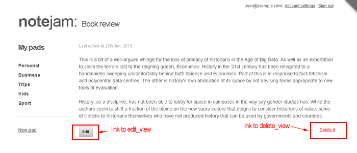

<details><summary>Table of Contents</summary>

* [Intro](https://github.com/trendoman/Midware/tree/main/tutorials/Notejam-App/01-Intro.md#intro)
* [Installing the application](https://github.com/trendoman/Midware/tree/main/tutorials/Notejam-App/02-Installing-the-application.md#installing-the-application)
* [Code Walkthrough](https://github.com/trendoman/Midware/tree/main/tutorials/Notejam-App/03-Code-Walkthrough.md#code-walkthrough)
   * [Notes](https://github.com/trendoman/Midware/tree/main/tutorials/Notejam-App/04-Notes.md#notes)
   * [Routes](https://github.com/trendoman/Midware/tree/main/tutorials/Notejam-App/05-Routes.md#routes)
   * [Filters](https://github.com/trendoman/Midware/tree/main/tutorials/Notejam-App/06-Filters.md#filters)
   * [Controller](https://github.com/trendoman/Midware/tree/main/tutorials/Notejam-App/07-Controller.md#controller)
   * [Views](https://github.com/trendoman/Midware/tree/main/tutorials/Notejam-App/08-Views.md#views)
       1. [List view](./09-List-View.md#views--notes-list-view)
       2. [Page view](https://github.com/trendoman/Midware/tree/main/tutorials/Notejam-App/10-Page-View.md#views--notes-page-view)
       3. [Create view](https://github.com/trendoman/Midware/tree/main/tutorials/Notejam-App/11-Create-View.md#views--notes-create-view)
       4. [Create view (with pad)](https://github.com/trendoman/Midware/tree/main/tutorials/Notejam-App/12-Create-View-(with-Pad).md#views--notes-create-view-with-pad)
       5. [Edit view](https://github.com/trendoman/Midware/tree/main/tutorials/Notejam-App/14-Edit-View.md#views--notes-edit-view)
       6. [Delete view](https://github.com/trendoman/Midware/tree/main/tutorials/Notejam-App/15-Delete-View.md#views--notes-delete-view)
   * [Pads](https://github.com/trendoman/Midware/tree/main/tutorials/Notejam-App/16-Pads.md#pads)
   * [Users](https://github.com/trendoman/Midware/tree/main/tutorials/Notejam-App/17-Users.md#users)
* [Wrapping up..](https://github.com/trendoman/Midware/tree/main/tutorials/Notejam-App/18-Wrapping-up.md#wrapping-up)
</details>

# Views » Notes Page View

This view shows the contents of a single note with links to its 'edit_view' and 'delete_view' -



Please open `views/notes/page_view.html` snippet in your text editor and we'll take a look at the code that implements this view.

```xml
<cms:pages id=rt_id limit='1' show_future_entries='1' >

    <cms:set my_title=k_page_title 'global' />

    <cms:capture into='my_content' >
        <p class="hidden-text">Last edited at <cms:date k_page_modification_date format='jS M, Y' /></p>
        <div class="note">
            <cms:nl2br><cms:show content /></cms:nl2br>
            <p></p>
        </div>
        <a href="<cms:route_link 'edit_view' rt_id=k_page_id />" class="button">Edit</a>
        <a href="<cms:route_link 'delete_view' rt_id=k_page_id />" class="delete-note">Delete it</a>
    </cms:capture>

</cms:pages>

<cms:embed 'views/layout_with_sidebar.html' />
```

Compared to the last view we studied, this code is rather simple.

The most important thing for you to note is the cms:pages block that encloses almost all the code in the snippet -

```xml
<cms:pages id=rt_id limit='1' show_future_entries='1' >
    ...
</cms:pages>
```

A **page_view**, as you'll remember, is invoked using the following URLs-

&emsp;***http:​//www​.yoursite​.com/notes/16***

&emsp;***http:​//www​.yoursite​.com/notes.php?q=16*** (without prettyURLs)

where, in the examples above, ***'16'*** is the ID of the note to be displayed.

You'll also remember that the **cms:match_route** will make available this value as a variable named 'rt_id'. The **cms:pages** tag fetches the single cloned-page with the ID specified in 'rt_id' and makes it available to all the code that it encloses.

```xml
<cms:pages id=rt_id limit='1' show_future_entries='1' >
    ... all data of the page specified in the URL is available for use here ..
</cms:pages>
```

The enclosed code now has access to all the data belonging to the specified page.

```xml
<cms:set my_title=k_page_title 'global' />

<cms:capture into='my_content' >
    <p class="hidden-text">Last edited at <cms:date k_page_modification_date format='jS M, Y' /></p>
    <div class="note">
        <cms:nl2br><cms:show content /></cms:nl2br>
        <p></p>
    </div>
    <a href="<cms:route_link 'edit_view' rt_id=k_page_id />" class="button">Edit</a>
    <a href="<cms:route_link 'delete_view' rt_id=k_page_id />" class="delete-note">Delete it</a>
</cms:capture>
```

The setting of 'my_title' and 'my_content' variables should be familiar to you by now as should be the way **cms:route_link** tag is used to craft the links to the 'edit_view' and 'delete_view'.

The last line simply hands over the 'my_title' and 'my_content' variables to the decorator template for final display -

```xml
<cms:embed 'views/layout_with_sidebar.html' />
```

Next we'll take a look at the 'create_view'.

---

**Next: [Create View →](https://github.com/trendoman/Midware/tree/main/tutorials/Notejam-App/11-Create-View.md#views--notes-create-view)**
