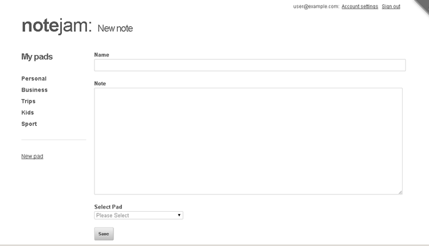

<details><summary>Table of Contents</summary>

* [Intro](https://github.com/trendoman/Midware/tree/main/tutorials/Notejam-App/01-Intro.md#intro)
* [Installing the application](https://github.com/trendoman/Midware/tree/main/tutorials/Notejam-App/02-Installing-the-application.md#installing-the-application)
* [Code Walkthrough](https://github.com/trendoman/Midware/tree/main/tutorials/Notejam-App/03-Code-Walkthrough.md#code-walkthrough)
   * [Notes](https://github.com/trendoman/Midware/tree/main/tutorials/Notejam-App/04-Notes.md#notes)
   * [Routes](https://github.com/trendoman/Midware/tree/main/tutorials/Notejam-App/05-Routes.md#routes)
   * [Filters](https://github.com/trendoman/Midware/tree/main/tutorials/Notejam-App/06-Filters.md#filters)
   * [Controller](https://github.com/trendoman/Midware/tree/main/tutorials/Notejam-App/07-Controller.md#controller)
   * [Views](https://github.com/trendoman/Midware/tree/main/tutorials/Notejam-App/08-Views.md#views)
       1. [List view](./09-List-View.md#views--notes-list-view)
       2. [Page view](https://github.com/trendoman/Midware/tree/main/tutorials/Notejam-App/10-Page-View.md#views--notes-page-view)
       3. [Create view](https://github.com/trendoman/Midware/tree/main/tutorials/Notejam-App/11-Create-View.md#views--notes-create-view)
       4. [Create view (with pad)](https://github.com/trendoman/Midware/tree/main/tutorials/Notejam-App/12-Create-View-(with-Pad).md#views--notes-create-view-with-pad)
       5. [Edit view](https://github.com/trendoman/Midware/tree/main/tutorials/Notejam-App/14-Edit-View.md#views--notes-edit-view)
       6. [Delete view](https://github.com/trendoman/Midware/tree/main/tutorials/Notejam-App/15-Delete-View.md#views--notes-delete-view)
   * [Pads](https://github.com/trendoman/Midware/tree/main/tutorials/Notejam-App/16-Pads.md#pads)
   * [Users](https://github.com/trendoman/Midware/tree/main/tutorials/Notejam-App/17-Users.md#users)
* [Wrapping up..](https://github.com/trendoman/Midware/tree/main/tutorials/Notejam-App/18-Wrapping-up.md#wrapping-up)
</details>

# Views » Notes Create View

Click on the 'New note' button and you'll reach this view.
It displays a form that can be used to create a new note



So we'll now concentrate only on `views/notes/create_view.html`. Open the file up in your editor and you'll recognize the general outline followed by all other views -

```xml
<cms:set my_title='New note' />

<cms:capture into='my_content' >
    ... bulk of the code here ...
</cms:capture>

<cms:embed 'views/layout_with_sidebar.html' />
```

The code within the **cms:capture** block is what if of interest to us. It consists entirely of a single **cms:form** block.

```xml
<cms:form
    masterpage=k_template_name
    mode='create'
    enctype='multipart/form-data'
    method='post'
    class="note"
    anchor='0' >

    ...
    ...

</cms:form>
```

If you are, as is expected for this tutorial, familiar with DataBound Forms ([http://www.couchcms.com/docs/concepts/databound-forms.html](http://www.couchcms.com/docs/concepts/databound-forms.html)) you'll recognize that this form is bound to the current template (i.e. ***notes.php***) and is meant to 'create' a new cloned page of the template.

Following is how the three inputs seen in the screenshot above are defined in the snippet -

```xml
<label for="name">Name</label>
<cms:input type="text" name='name' id="name"  required='1' />

<label for="text">Note</label>
<cms:input type='bound' name='content' id="text"></cms:input>

...
...

<label for="list">Select Pad</label>
<cms:input
    type='dropdown'
    name='pad'
    id='list'
    opt_values=my_opt_values
    opt_selected=my_current_pad
    required='1'
/>
```

You'll notice that only one of the three inputs is of type 'bound' (the 'content'). The other two are regular inputs used in normal forms. That is perfectly fine as we'll explicitly feed the values selected in them to the **cms:db_persist_form** tag that actually creates the new page in the form's success condition -

```xml
<cms:if k_success>
    <cms:db_persist_form
        k_page_title=frm_name
        k_page_name="<cms:random_name />"
        note_pad=frm_pad
        note_owner=k_user_id
    />
    ...
</cms:if>
```

You'll recognize above that the 'frm_name' and 'frm_pad' being used to set the 'k_page_title' and 'note_pad' fields of note represent our form's non-bound **cms:input**.

You might well ask here why we did not use these two inputs in 'bound' mode? The reason for 'name' is mainly cosmetic. The 'bound' input uses the styling of admin-panel and stretches 99% width of the screen. We could have used CSS to make it look the way we want but I simply chose to use a non-bound **cms:input** instead.

The answer for the 'dropdown' input showing the pads is more compelling -

this dropdown, in bound mode (i.e. as seen in the admin-panel), shows \*all\* the pads in the application. We, on the other hand, want to display only those pads that belong to the logged-in user. To do so, we use a non-bound dropdown explicitly feeding it only the pads belonging to the user to show as list-items.

How we do this might be interesting to you.

If suppose following is the definition of a dropdown -

```xml
<cms:input
    type='dropdown'
    name='pad'
    opt_values='Personal=3 | Business=5 | Sports=10'
    opt_selected='5'
    required='1'
/>
```

It should be easy to see that the dropdown will display three items with the 'Business' item being in the selected state.

Now compare the definition above with how we have actually defined the 'pad' dropdown -

```xml
<cms:input
    type='dropdown'
    name='pad'
    id='list'
    opt_values=my_opt_values
    opt_selected=my_current_pad
    required='1'
/>
```

You'll notice that instead of providing explicit values for 'opt_values' and 'opt_selected', we are using variables instead.

It is the 'my_opt_values' variable that provides the equivalent of the 'Personal=3 | Business=5 | Sports=10' string we explicitly used before. Only now, we dynamically craft the string to contain only the names (and IDs) of pads that belong to the logged-in user -

The portion of the code that sets the 'my_opt_values' variable is this -

```xml
<cms:capture into='my_opt_values'>
    Please Select=-
    <cms:pages masterpage='pads.php' custom_field="pad_owner=<cms:show k_user_name />">
       | <cms:show k_page_title  />=<cms:show k_page_id  />
    </cms:pages>
</cms:capture>
```

The code above simply uses **cms:pages** to fetch all pads that are related to the current logged-in user and then stuffs their names and IDs (separated by '|') into the 'my_opt_values' variable. This shows to the user only the pads that she created.

Please take a look at the 'opt_selected' parameter. We use it to show one of the pads in the list above as pre-selected. As can be seen, instead of a hard-coded value, we are using a variable named 'my_current_pad' for this.

If you take a look at the snippet again and you'll find that this 'my_current_pad' is not set anywhere. Actually this will be done by the 'create_with_pad_view' we'll discuss next. For the **create_view** being currently discussed, this variable always remains empty and so no pad is shown in a selected state in this view.

The last element in the form is the submit button

```xml
<input type="submit" value="Save">
```

which triggers the submission of the form.

Upon successful submission, the **k_success** block executes and it is here that the **cms:db_persist_form** tag creates a new note using the submitted values -

```xml
<cms:if k_success>
    <cms:db_persist_form
        k_page_title=frm_name
        k_page_name="<cms:random_name />"
        note_pad=frm_pad
        note_owner=k_user_id
    />

    <cms:if "<cms:not k_persist_error />">
        <cms:redirect "<cms:route_link 'page_view' rt_id=k_last_insert_id />"  />
    </cms:if>
</cms:if>
```

Notice how we are associating the current logged-in user to the new note by setting

```
note_owner=k_user_id
```

Notice also how we are setting the **k_page_name** (a required field for any cloned page) to a random name

```xml
k_page_name="<cms:random_name />"
```

If the creation process completes without any error, we redirect the user to the 'page_view' of the note we just created (the 'k_last_insert_id' variable made available by **cms:db_persist_form** contains its ID)

```xml
<cms:if "<cms:not k_persist_error />">
    <cms:redirect "<cms:route_link 'page_view' rt_id=k_last_insert_id />"  />
</cms:if>
```

So that brings us to the end of the 'create_view'. Next we'll take a look at the 'create_with_pad_view' which actually 'piggy-backs' on the create view we just discussed.

---

**Next: [Create View (with Pad) →](https://github.com/trendoman/Midware/tree/main/tutorials/Notejam-App/12-Create-View-(with-Pad).md#views--notes-create-view-with-pad)**
