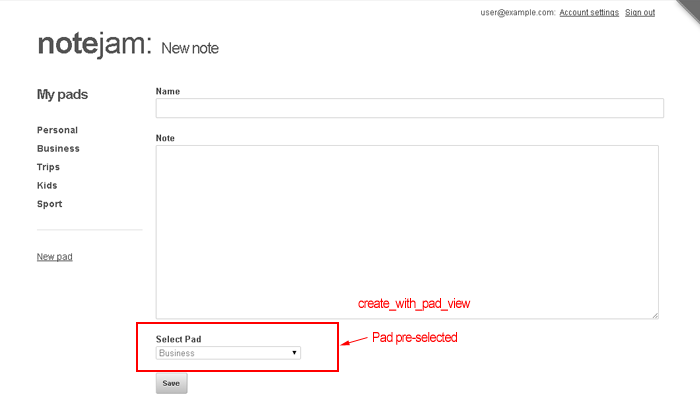

<details><summary>Table of Contents</summary>

* [Intro](https://github.com/trendoman/Midware/tree/main/tutorials/Notejam-App/01-Intro.md#intro)
* [Installing the application](https://github.com/trendoman/Midware/tree/main/tutorials/Notejam-App/02-Installing-the-application.md#installing-the-application)
* [Code Walkthrough](https://github.com/trendoman/Midware/tree/main/tutorials/Notejam-App/03-Code-Walkthrough.md#code-walkthrough)
   * [Notes](https://github.com/trendoman/Midware/tree/main/tutorials/Notejam-App/04-Notes.md#notes)
   * [Routes](https://github.com/trendoman/Midware/tree/main/tutorials/Notejam-App/05-Routes.md#routes)
   * [Filters](https://github.com/trendoman/Midware/tree/main/tutorials/Notejam-App/06-Filters.md#filters)
   * [Controller](https://github.com/trendoman/Midware/tree/main/tutorials/Notejam-App/07-Controller.md#controller)
   * [Views](https://github.com/trendoman/Midware/tree/main/tutorials/Notejam-App/08-Views.md#views)
       1. [List view](./09-List-View.md#views--notes-list-view)
       2. [Page view](https://github.com/trendoman/Midware/tree/main/tutorials/Notejam-App/10-Page-View.md#views--notes-page-view)
       3. [Create view](https://github.com/trendoman/Midware/tree/main/tutorials/Notejam-App/11-Create-View.md#views--notes-create-view)
       4. [Create view (with pad)](https://github.com/trendoman/Midware/tree/main/tutorials/Notejam-App/12-Create-View-(with-Pad).md#views--notes-create-view-with-pad)
       5. [Edit view](https://github.com/trendoman/Midware/tree/main/tutorials/Notejam-App/14-Edit-View.md#views--notes-edit-view)
       6. [Delete view](https://github.com/trendoman/Midware/tree/main/tutorials/Notejam-App/15-Delete-View.md#views--notes-delete-view)
   * [Pads](https://github.com/trendoman/Midware/tree/main/tutorials/Notejam-App/16-Pads.md#pads)
   * [Users](https://github.com/trendoman/Midware/tree/main/tutorials/Notejam-App/17-Users.md#users)
* [Wrapping up..](https://github.com/trendoman/Midware/tree/main/tutorials/Notejam-App/18-Wrapping-up.md#wrapping-up)
</details>

# Views » Notes Create-View (with Pad)

Click one of the pads listed in the sidebar and you'll see a list of notes that belong to that particular pad.

On this screen if we click 'New note', we get the same 'create_view' we discussed above except that now the pad we were browsing in the last step, appears to be selected automatically.



This is the **'create_with_pad_view'** and is actually just a thin wrapper around **'[create_view](https://github.com/trendoman/Midware/tree/main/tutorials/Notejam-App/11-Create-View.md#views--notes-create-view)'**.

Please take a look at the snippet implementing it (i.e. `views/notes/create_with_pad_view.html`) and you'll find that it simply sets a variable named 'my_current_pad' and delegates over the page rendering to `views/notes/create_view.html` which implements the 'create_view' we've already studied

```xml
<cms:set my_current_pad=rt_id 'global' />

<cms:embed "views/notes/create_view.html" />
```

The 'rt_id' variable used above, you'll remember, would contain the value passed in the URL for the path parameter named '{:id}' as defined in this views route -

```xml
<cms:route
    name='create_with_pad_view'
    path='{:id}/create'
    filters='authenticated | pad_exists | owns_pad'
    >

    <cms:route_validators
        id='non_zero_integer'
    />
</cms:route>
```

So, if the URL invoking the 'create_with_pad_view' was

&emsp;***http:​//www​.yoursite​.com/notes/12/create***

or

&emsp;***http:​//www​.yoursite​.com/notes.php?q=12/create*** (without prettyURLs)


the 'rt_id' (and hence the 'my_current_pad') variable will contain a value of ***12***.

The action now gets delegated to the snippet implementing the 'create_view'.

You'll remember from our discussion above about 'create_view', the definition of the 'dropdown' input showing all pads belonging to the current user was this -

```xml
<cms:input
    type='dropdown'
    name='pad'
    id='list'
    opt_values=my_opt_values
    opt_selected=my_current_pad
    required='1'
/>
```

Notice how it is using the 'my_current_pad' set by this view to pre-select the pad specified in the URL leading to this view. In our example, any listed pad with an ID of '12' would appear already selected in the form.

With that we now move on to the 'edit_view'.

---

**Next: [Edit View →](https://github.com/trendoman/Midware/tree/main/tutorials/Notejam-App/14-Edit-View.md#views--notes-edit-view)**
