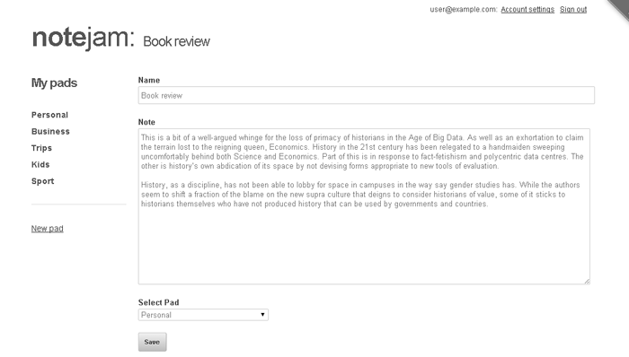

<details><summary>Table of Contents</summary>

* [Intro](https://github.com/trendoman/Midware/tree/main/tutorials/Notejam-App/01-Intro.md#intro)
* [Installing the application](https://github.com/trendoman/Midware/tree/main/tutorials/Notejam-App/02-Installing-the-application.md#installing-the-application)
* [Code Walkthrough](https://github.com/trendoman/Midware/tree/main/tutorials/Notejam-App/03-Code-Walkthrough.md#code-walkthrough)
   * [Notes](https://github.com/trendoman/Midware/tree/main/tutorials/Notejam-App/04-Notes.md#notes)
   * [Routes](https://github.com/trendoman/Midware/tree/main/tutorials/Notejam-App/05-Routes.md#routes)
   * [Filters](https://github.com/trendoman/Midware/tree/main/tutorials/Notejam-App/06-Filters.md#filters)
   * [Controller](https://github.com/trendoman/Midware/tree/main/tutorials/Notejam-App/07-Controller.md#controller)
   * [Views](https://github.com/trendoman/Midware/tree/main/tutorials/Notejam-App/08-Views.md#views)
       1. [List view](./09-List-View.md#views--notes-list-view)
       2. [Page view](https://github.com/trendoman/Midware/tree/main/tutorials/Notejam-App/10-Page-View.md#views--notes-page-view)
       3. [Create view](https://github.com/trendoman/Midware/tree/main/tutorials/Notejam-App/11-Create-View.md#views--notes-create-view)
       4. [Create view (with pad)](https://github.com/trendoman/Midware/tree/main/tutorials/Notejam-App/12-Create-View-(with-Pad).md#views--notes-create-view-with-pad)
       5. [Edit view](https://github.com/trendoman/Midware/tree/main/tutorials/Notejam-App/14-Edit-View.md#views--notes-edit-view)
       6. [Delete view](https://github.com/trendoman/Midware/tree/main/tutorials/Notejam-App/15-Delete-View.md#views--notes-delete-view)
   * [Pads](https://github.com/trendoman/Midware/tree/main/tutorials/Notejam-App/16-Pads.md#pads)
   * [Users](https://github.com/trendoman/Midware/tree/main/tutorials/Notejam-App/17-Users.md#users)
* [Wrapping up..](https://github.com/trendoman/Midware/tree/main/tutorials/Notejam-App/18-Wrapping-up.md#wrapping-up)
</details>

# Views » Notes Edit View

This view shows a form with the content of the page being edited pre-populated in the inputs for further editing -



To study this view, please open the `views/notes/edit_view.html` snippet implementing this view in your text editor and \*also\* open the '**create_view**' snippet we studied above in another instance of the editor.

You'll notice that more than 95% of code is the same in both the views. This is a common occurrence in almost all applications and you'll usually always find the 'edit' and 'create' code to be very similar.

Since we have already studied the 'create' code in detail, for this view I'll just dwell on the aspects that differ from it.

The first important thing that you'll notice in the 'edit_view' is that we are wrapping up almost the entire code within a **cms:pages** block -

```xml
<cms:pages id=rt_id limit='1' show_future_entries='1'>
    ...
</cms:pages>
```

This is identical to what we did in the 'page_view', if you remember. The idea is to fetch the single page (a 'note' in our case) specified in the 'rt_id' variable (which, of course, is the page ID as specified in the URL). Since the rest of the code is then enveloped within the **cms:pages** block, all the variables belonging to the fetched page (e.g. ***k_page_title***, ***k_page_name***, all editable regions etc.) will be available directly to the code within.

You'll immediately see the form code making use of the fetched page's data as its parameters (*page_id=k_page_id*).

```xml
<cms:form
    masterpage=k_template_name
    mode='edit'
    page_id=k_page_id
    enctype='multipart/form-data'
    method='post'
    class="note"
    anchor='0' >

    ..
    ..
</cms:form>
```

You'll also notice that this view has the DataBound Form's 'mode' set to '***edit***' (as opposed to the 'create_view' where it was 'create').

The definition of the three inputs defined within the form are almost the same except for some minor changes in the two inputs that we are using in a non-bound manner. The 'content' input is a 'bound' input and so it automatically shows the existing data contained within it.\
The 'name' and 'pad' inputs, however, are non-bound and so we'll have to explicitly fill the existing data of the page in them.

This is how we do it for the 'name' field where we explicitly set the 'value' parameter -

```xml
<cms:input type="text" name='name' id="name"  required='1' value="<cms:show k_page_title />" />
```

For the 'pad' field (which is the dropdown showing all pads belonging to the logged-in user), we'll fetch the pad the note being edited belongs to using

```xml
<cms:related_pages 'note_pad' ids_only='1' />
```

which, courtesy the 'ids_only' parameter, returns only the ID of the related page, and then set the value as the 'opt_selected' parameter -

```xml
<cms:input
    type='dropdown'
    name='pad'
    id='list'
    opt_values=my_opt_values
    opt_selected="<cms:related_pages 'note_pad' ids_only='1' />"
    required='1' />
```

This way, whatever pad the note belonged to will appear in a selected state.

The final difference between create_view and this edit_view is the lesser number of parameters we need to set in the **cms:db_persist_form** tag

```xml
<cms:if k_success>
    <cms:db_persist_form
        k_page_title=frm_name
        note_pad=frm_pad
    />
    ..
    ..
</cms:if>
```

Please notice that we don't have to explicitly set 'content' field as that is a bound field and will automatically get saved. The two non-bound field have to be explicitly passed to **cms:db_persist_form**.

Compare the code above to that used in 'create_view' -

```xml
<cms:if k_success>
    <cms:db_persist_form
        k_page_title=frm_name
        k_page_name="<cms:random_name />"
        note_pad=frm_pad
        note_owner=k_user_id
    />
    ..
    ..
</cms:if>
```

Notice that now we don't have to set the 'k_page_name' and 'note_owner' as these two values won't change once set at creation time.

> **NOTE:** Depending on your particular application's needs, the ***k_page_name*** might be editable (but then you'd certainly not set it initially to a random value) but the 'owner' will definitely remain unchanged.

And that is it. We've covered the edit_view.

We'll cover the last view of 'notes' next - the 'delete_view'.

---

**Next: [Delete View →](https://github.com/trendoman/Midware/tree/main/tutorials/Notejam-App/15-Delete-View.md#views--notes-delete-view)**
