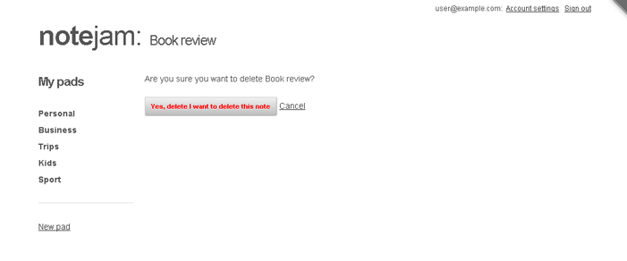

<details><summary>Table of Contents</summary>

* [Intro](https://github.com/trendoman/Midware/tree/main/tutorials/Notejam-App/01-Intro.md#intro)
* [Installing the application](https://github.com/trendoman/Midware/tree/main/tutorials/Notejam-App/02-Installing-the-application.md#installing-the-application)
* [Code Walkthrough](https://github.com/trendoman/Midware/tree/main/tutorials/Notejam-App/03-Code-Walkthrough.md#code-walkthrough)
   * [Notes](https://github.com/trendoman/Midware/tree/main/tutorials/Notejam-App/04-Notes.md#notes)
   * [Routes](https://github.com/trendoman/Midware/tree/main/tutorials/Notejam-App/05-Routes.md#routes)
   * [Filters](https://github.com/trendoman/Midware/tree/main/tutorials/Notejam-App/06-Filters.md#filters)
   * [Controller](https://github.com/trendoman/Midware/tree/main/tutorials/Notejam-App/07-Controller.md#controller)
   * [Views](https://github.com/trendoman/Midware/tree/main/tutorials/Notejam-App/08-Views.md#views)
       1. [List view](./09-List-View.md#views--notes-list-view)
       2. [Page view](https://github.com/trendoman/Midware/tree/main/tutorials/Notejam-App/10-Page-View.md#views--notes-page-view)
       3. [Create view](https://github.com/trendoman/Midware/tree/main/tutorials/Notejam-App/11-Create-View.md#views--notes-create-view)
       4. [Create view (with pad)](https://github.com/trendoman/Midware/tree/main/tutorials/Notejam-App/12-Create-View-(with-Pad).md#views--notes-create-view-with-pad)
       5. [Edit view](https://github.com/trendoman/Midware/tree/main/tutorials/Notejam-App/14-Edit-View.md#views--notes-edit-view)
       6. [Delete view](https://github.com/trendoman/Midware/tree/main/tutorials/Notejam-App/15-Delete-View.md#views--notes-delete-view)
   * [Pads](https://github.com/trendoman/Midware/tree/main/tutorials/Notejam-App/16-Pads.md#pads)
   * [Users](https://github.com/trendoman/Midware/tree/main/tutorials/Notejam-App/17-Users.md#users)
* [Wrapping up..](https://github.com/trendoman/Midware/tree/main/tutorials/Notejam-App/18-Wrapping-up.md#wrapping-up)
</details>

# Views » Notes Delete View

The **delete_view**, reached by clicking the 'Delete it' link found on the 'page_view', shows a prominent button asking for confirmation about the action (and a 'Cancel' link that leads back to the 'page_view' of the note) —



The overall logic of this view is pretty simple – pressing the confirmation button submits a form. The **k_success** code of the form then effects the actual deletion.

Please take a look at the snippet implementing this view - `views/notes/delete_view.html`.

You'll notice that, similar to 'page_view' and 'create_view', there is a **cms:pages** block enveloping all the main code

```xml
<cms:pages id=rt_id limit='1' show_future_entries='1'>
    ... form shown here ...
</cms:pages>
```

Needless to say, it fetches the page to be deleted and makes it available to the form enclosed within the block. The form, you'll recognize, is a *DataBound Form* attached to the page fetched above (via its 'page_id' parameter set to ***k_page_id***)

```xml
<cms:form
    masterpage=k_template_name
    mode='edit'
    page_id=k_page_id
    method='post'
    anchor='0'
    >

    ...
    ...

    <p>Are you sure you want to delete <cms:show k_page_title />?</p>
    <cms:input name='submit' type="submit" class="button red" value="Yes, delete I want to delete this note" />
    <a href="<cms:route_link 'page_view' rt_id=k_page_id />">Cancel</a>

</cms:form>
```

All the action of this view lies in the **k_success** block of the form -

```xml
<cms:if k_success>
    <cms:db_delete_form />
    <cms:redirect "<cms:route_link 'list_view' />"  />
</cms:if>
```

– where the **cms:db_delete_form** tag simply goes ahead and deletes the page bound to the containing form. The **cms:redirect** statement that follows it leads the user back to the list_view.

That ends our tour through this view but in closing I'd like to mention a few important points about the **cms:db_delete_form** tag we used.

The **cms:db_delete_form** tag works only from within a DataBound Form, as done above. This, however, necessarily constrains us in deleting only single pages (as a DataBound Form can bind with just a single page). If your design calls for deleting multiple pages, you'll have to use its sister tag named **cms:db_delete** which has no such constrains and works as a standalone statement.

You'll find an example of **cms:db_delete** usage in the following thread of our forum (specifically, in answer to the post) -

**Deleting page from the front-end ([viewtopic.php?f=4&t=8087](http://www.couchcms.com/forum/viewtopic.php?f=4&t=8087))**

The important point to keep in mind while using **cms:db_delete** (as discussed in the thread) is to \*always\* combine it with nonces (using **cms:cms:create_nonce** and **cms:validate_nonce** tags). Never use it without the nonces protection as it will open up your script to CSRF vulnerability.

In our snippet that we discussed above, the DataBound Form hosting the **cms:db_delete_form** tag automatically takes care of creating/validating those nonces so we didn't have to bother implementing that security ourselves. This is one reason why using **cms:db_delete_form** could be an easier way of implementing delete functionality.

Anyway, that completes our line-by-line tour through all the code that implements the 'Notes' portion of the Notejam application.

We'll move to the 'Pads' section next.

---

**Next: [Pads →](https://github.com/trendoman/Midware/tree/main/tutorials/Notejam-App/16-Pads.md#pads)**
